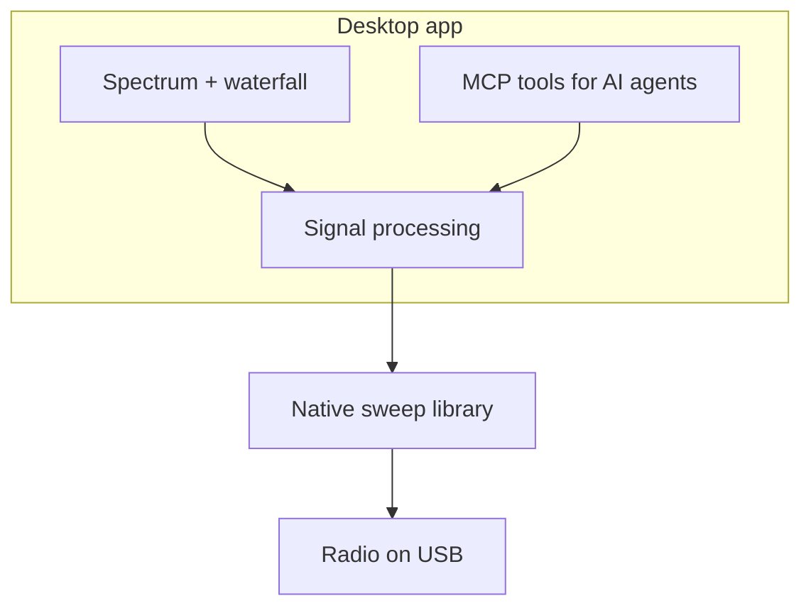

# HackRF Spectrum Analyzer

**Live RF for the operator. The same sweep for AI agents via MCP.**

[](https://github.com/chris-piekarski/hackrf-spectrum-analyzer/releases/latest)
[](docs/mcp.md)
[](LICENSE)
[](docs/building.md)
[](docs/hackrf-setup.md)
[](docs/hackrf-setup.md)
[](docs/building.md)
[](https://github.com/chris-piekarski/hackrf-spectrum-analyzer/commits/master)

A Java 21 desktop analyzer for the [HackRF One](https://greatscottgadgets.com/hackrf/) with a **Model Context Protocol** server on the same JVM that holds the radio. You get spectrum, waterfall, FM Listen, and live ATSC 1.0 Watch. Grok, Claude, Cursor, or any MCP client can inspect the same RF data, park Listen/Watch, and diagnose the ATSC pipeline — **without a second USB open**.

```bash
make mcp    # GUI + MCP on 127.0.0.1:8765
```

Full agent setup: **[docs/mcp.md](docs/mcp.md)**.


*Live ATSC Watch with a decoded MPEG-2 frame in the TV-tuner preview.*

This is a maintained fork of [pavsa/hackrf-spectrum-analyzer](https://github.com/pavsa/hackrf-spectrum-analyzer).

## Why MCP

| | |
|---|---|
| **Same bins as the plot** | Snapshots come from `onFullSweepProcessed`, not screenshots or log scrape |
| **One radio** | MCP is in-process; a second `hackrf_sweep` would steal USB |
| **Local, explicit control** | Read tools plus `fm_listen` / `tv_watch`; localhost / stdio; hop holes omitted (not −150 dBm) |
| **Operator-ready GUI** | Auto gain, auto-scale dB, waterfall time axis, Quick Select |

Ask an attached agent: *peak and noise on this window? any live FM dial hits? watch RF 28; where is ATSC failing? what firmware is on the HackRF?*

## What the GUI does

- Sweeps a range and draws live spectrum + waterfall (time scale on the left)
- **Quick Select** for Wi‑Fi, LTE, FM, TV, NFC, amateur 6m / 2m / 70 cm / 33 cm
- Auto gain (default) and auto-scale dB so FM/Wi‑Fi peaks are readable
- Mono broadcast-FM Listen with station seek and audio spectrum
- ATSC 1.0 Watch with MPEG-2 preview, AC-3 audio, and stage diagnostics
- Peak hold, persistent display, spur filter, EU/USA allocation overlays
- Bias-tee and onboard **Antenna LNA +14 dB**
- Sidebar: board, serial, firmware, Restart / Stop / CLKOUT

## Quick Start

```bash
git clone --recurse-submodules https://github.com/chris-piekarski/hackrf-spectrum-analyzer.git
cd hackrf-spectrum-analyzer
make help          # all commands
make deps          # Ubuntu/Debian build packages
make mcp           # build if needed, launch GUI + MCP
```

Plug in the radio first. On Linux, run `make udev` once so the USB device stays writable. Full walkthrough: [docs/getting-started.md](docs/getting-started.md). Agent wiring: [docs/mcp.md](docs/mcp.md).

### How it is put together



## Documentation

- [MCP for AI agents](docs/mcp.md) — tools, proxy, what v1 can and cannot do
- [Getting Started](docs/getting-started.md)
- [Building](docs/building.md)
- [Development & Testing](docs/development.md)
- [Radio setup](docs/hackrf-setup.md) (udev, firmware, Windows drivers)
- [Usage](docs/usage.md)
- [Architecture](docs/architecture.md)
- [Repository stats](docs/stats.md) (`make stats`)
- [Contributing](docs/contributing.md)

## Requirements

- A HackRF (One or compatible) with firmware **v2024.02.1** or newer. This app is built against host SDK **v2026.01.3**.
- Java 21+ with a display (not a headless JRE)
- `ffmpeg` on `PATH` for decoded ATSC video/audio

Building also needs Maven and a C toolchain — see [building.md](docs/building.md).

## Common commands

```bash
make help      # colorized list
make test      # unit tests (no radio required)
make lint      # compile check
make stats     # refresh docs/stats.md
make mermaid   # parse-check diagrams
make start     # launch
make mcp       # launch with local MCP (127.0.0.1:8765)
make info      # what is plugged in
```

## Testing

Unit tests cover the core processing path and do not need a radio.

```bash
make test
```

Coverage is written with JaCoCo.

## License

GPLv3

## Acknowledgments

- Original work by pavsa and contributors
- Great Scott Gadgets / the HackRF project
- People using this for real RF work

---

For AI agents and automated contributors, see [AGENTS.md](AGENTS.md).
