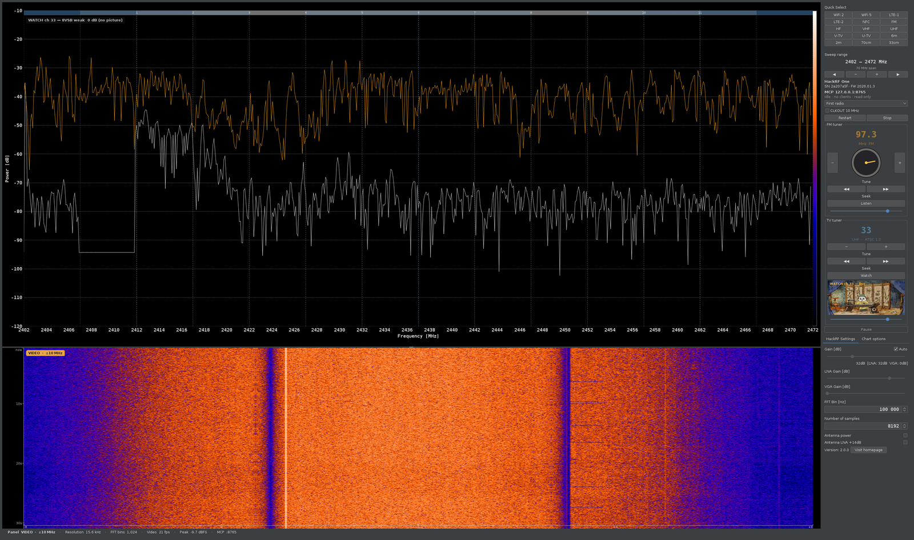
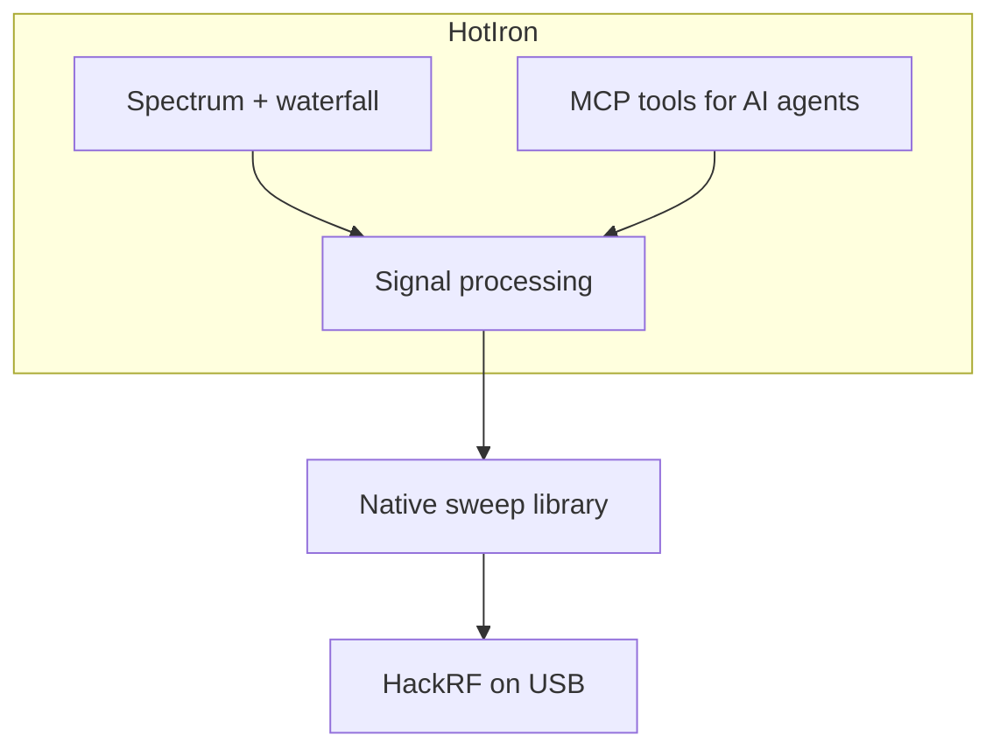

# HotIron

```
    __  __      __  ____
   / / / /___  / /_/  _/________  ____
  / /_/ / __ \/ __// // ___/ __ \/ __ \
 / __  / /_/ / /__/ // /  / /_/ / / / /
/_/ /_/\____/\__/___/_/   \____/_/ /_/
        heat on the dial -- agents copy the RF bins
```

**Heat on the dial. QSY to live hits. Agents copy the RF bins.**

[](https://github.com/chris-piekarski/hot-iron/releases/latest)
[](docs/agents.md)
[](LICENSE)
[](docs/building.md)
[](docs/hardware.md)
[](docs/hardware.md)
[](docs/building.md)
[](https://github.com/chris-piekarski/hot-iron/commits/master)

A Java 21 desktop for the [HackRF One](https://greatscottgadgets.com/hackrf/) (and Pro). Sweep the waterfall, **QSY** to live FM/TV hits, and let agents **copy** the same RF bins over MCP — **one rig**, no second USB open.

```bash
make mcp    # GUI + MCP on 127.0.0.1:8765
```

Agent setup: **[docs/agents.md](docs/agents.md)**. Operator UI: **[docs/operator.md](docs/operator.md)**.



*Live ATSC Watch with a decoded MPEG-2 frame in the TV-tuner preview.*

## Three modes, one rig

| Mode | What it does |
|---|---|
| **Sweep** | Wideband bins, waterfall, occupancy, live FM/TV/Wi-Fi labels |
| **Listen** | Park on a detected US FM station (knob / header / MCP `fm_listen`), mono WFM |
| **Watch** | Park on a detected ATSC channel (MCP `tv_watch`), 8VSB → MPEG-2 preview |

Listen and Watch **QRT** the sweep. **Restart** puts the rig back on sweep.

## Why MCP

| | |
|---|---|
| **Agents copy the plot** | Snapshots come from `onFullSweepProcessed`, not screenshots or log scrape |
| **One rig** | MCP is in-process; a second `hackrf_sweep` would steal USB |
| **Local, explicit control** | Read tools plus `fm_listen` / `tv_watch`; localhost / stdio; hop holes omitted (not −150 dBm) |
| **Operator-ready GUI** | Auto gain, auto-scale dB, waterfall time axis, Quick Select |

Ask an attached agent: *peak and noise on this window? any live FM dial hits? watch RF 28; where is ATSC failing? what firmware is on the HackRF?*

## What the GUI does

- Sweeps a range and draws live spectrum + waterfall (time scale on the left)
- **Quick Select** for All (1–7250 MHz), Wi‑Fi, LTE, FM, TV, NFC, amateur 6m / 2m / 70 cm / 33 cm
- Auto gain (default) and auto-scale dB so FM/Wi‑Fi peaks are readable
- Live FM labels snap to the US dial; the analog **knob** detents on detected stations only
- FM Listen keeps the audio waterfall while the main chart shows the live ±2 MHz local RF spectrum
- ATSC 1.0 Watch with live ±8 MHz RF chart, MPEG-2 preview, AC-3 audio, and stage diagnostics
- Peak hold, persistent display, spur filter, EU/USA allocation overlays
- Bias-tee and onboard **Antenna LNA +14 dB**
- Sidebar: board, serial, firmware, Restart / Stop / CLKOUT

## Quick Start

```bash
git clone --recurse-submodules https://github.com/chris-piekarski/hot-iron.git
cd hot-iron
make help          # all commands
make deps          # Ubuntu/Debian build packages
make mcp           # build if needed, launch GUI + MCP
```

Plug in the radio first. On Linux, run `make udev` once so the USB device stays writable. Full walkthrough: [docs/getting-started.md](docs/getting-started.md). Agent wiring: [docs/agents.md](docs/agents.md).

### How it is put together



## Documentation

- [MCP for AI agents](docs/agents.md) — tools, proxy, what v1 can and cannot do
- [Getting Started](docs/getting-started.md)
- [Building](docs/building.md)
- [Development & Testing](docs/develop.md)
- [Radio setup](docs/hardware.md) (udev, firmware, Windows drivers)
- [Operator UI](docs/operator.md)
- [NFC / HF RFID](docs/nfc.md) — 13.56 MHz overlay, classifier, and what not to decode
- [nRF 2.4 GHz sniffer](docs/nrf-sniffer.md) — bench J-Link / BLE overlay + UART host (15.4 / ANT decode not wired)
- [Architecture](docs/architecture.md) — layers, exclusive USB, MVC/hooks, queues, policies
- [Repository stats](docs/stats.md) (`make stats`)
- [Contributing](docs/contributing.md)

## Requirements

- A HackRF (One or compatible) with firmware **v2024.02.1** or newer. This app is built against host SDK **v2026.01.3**.
- Java 21+ with a display (not a headless JRE)
- `ffmpeg` on `PATH` for decoded ATSC video/audio

Building also needs Maven and a C toolchain — see [building.md](docs/building.md).

## Common commands

```bash
make help      # colorized list
make test      # unit tests (no radio required)
make lint      # compile check
make stats     # refresh docs/stats.md
make mermaid   # parse-check diagrams
make start     # launch
make mcp       # launch with local MCP (127.0.0.1:8765)
make info      # what is plugged in
```

## Testing

Unit tests cover the core processing path and do not need a radio.

```bash
make test
```

Coverage is written with JaCoCo.

## License

GPLv3. This is a modified version of [pavsa/hackrf-spectrum-analyzer](https://github.com/pavsa/hackrf-spectrum-analyzer). The license stays GNU GPL v3.

## Acknowledgments

- Original work by pavsa and contributors
- Great Scott Gadgets — **HackRF** is a GSG trademark; this app drives a HackRF, it is not a GSG product
- GNU Radio `gr-dtv` (FSF) inner loops and Phil Karn libfec for ATSC
- People using this for real RF work

---

For AI agents and automated contributors, see [AGENTS.md](AGENTS.md).
