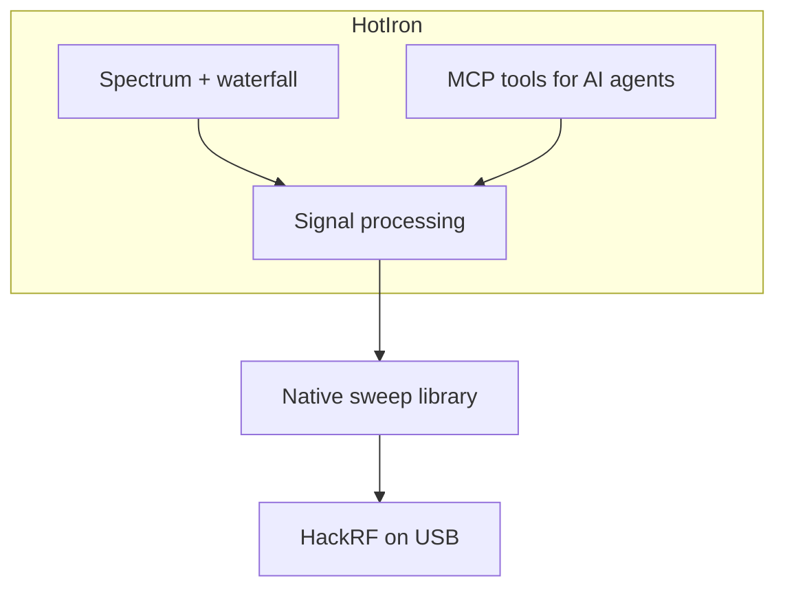

# HotIron

```
    __  __      __  ____
   / / / /___  / /_/  _/________  ____
  / /_/ / __ \/ __// // ___/ __ \/ __ \
 / __  / /_/ / /__/ // /  / /_/ / / / /
/_/ /_/\____/\__/___/_/   \____/_/ /_/
        heat on the dial -- agents copy the RF bins
```

**Heat on the dial. Click a band. QSY to the hit. Agents copy the RF bins.**

[](https://github.com/chris-piekarski/hot-iron/releases/latest)
[](docs/agents.md)
[](LICENSE)
[](docs/building.md)
[](docs/hardware.md)
[](docs/hardware.md)
[](docs/building.md)
[](https://github.com/chris-piekarski/hot-iron/commits/master)

A Java 21 desktop for the [HackRF One](https://greatscottgadgets.com/hackrf/) (and Pro). One rig. The whole **1 MHz–7.25 GHz** window on a chirp. Sweep. Listen. Watch. Sniff. Local agents **copy** the same bins over MCP — they never open USB.

```bash
make start    # GUI + MCP on 127.0.0.1:8765
```

Operator UI: **[docs/operator.md](docs/operator.md)**. Agent setup: **[docs/agents.md](docs/agents.md)**.


*Live **Wi‑Fi 2** sweep (2402–2472 MHz). Survey wave across the HackRF floor→ceiling; gold window is the radio. BLE sniff sits in the tools slot because 2.4 GHz is in view.*

## One radio. Several ways to use it.

Sweep, Listen, Watch, and NFC Sniff **share the HackRF**. Last one wins. BLE sniff is a **second USB** (bench nRF) and does not park the One.

| | What you get |
|---|---|
| **Sweep** | Hop the stick. Live spectrum + RF waterfall. Occupancy. Wi‑Fi / FM / TV / BLE labels on the header. |
| **Listen** | Park 4 MS/s on a US FM dial. Top chart is the ±2 MHz neighborhood. Bottom strip splits: **RF ±2 MHz** waterfall beside **AUDIO 0–16 kHz**. Mono WFM on the speakers. |
| **Watch** | Park 16 MS/s on US ATSC 1.0. ±8 MHz RF chart, **VIDEO** IQ waterfall, MPEG-2 in the tuner, AC-3 on the speakers. |
| **NFC Sniff** | Park 10 MS/s (LO 11.56 MHz). 12–15 MHz chart + waterfall. Type A/B frames in the sidebar. Receive only. |
| **BLE sniff** | nRF / J-Link ACM. Advertising PDUs on a second USB. HackRF keeps sweeping 2.4 GHz. |

**Restart** QSY’s back to sweep. **Stop** drops USB so `make info` or GNU Radio can have the stick.

## Why the banner exists

The top of the window is the HackRF’s whole playground, log-scaled so NFC and FM are not a one-pixel joke next to 5 GHz.

- **Services above** the chirp, **HF / VHF / UHF / All** below (blue / teal / copper / cream)
- Chip width follows the band; gold window is the live sweep
- Digits + `◀ − + ▶` sit beside the wave — **− / +** grow or shrink that gold slice
- Band tuners appear in the **520 px** Spectrum tools column only when that service is in view; MCP log is under the slot

Click **FM**. The gold window jumps to 88–108. Click **Listen**. The hop-sweep **QRT**s and you are parked on the dial.

## Why MCP

| | |
|---|---|
| **Agents copy the plot** | Snapshots come from live bins (`onFullSweepProcessed` / parked IQ), not screenshots or log scrape |
| **One rig** | MCP is in-process. A second `hackrf_sweep` would steal USB. |
| **Local, explicit** | Read tools plus `fm_listen` / `tv_watch` / `nfc_sniff` / `ble_sniff`. Localhost / stdio. Hop holes omitted (not −150 dBm). |

Ask an attached agent: *peak and noise on this window? any live FM dial hits? watch RF 28; where is ATSC failing? what firmware is on the HackRF?*

## Also on the glass

- Auto gain and auto-scale dB so FM and Wi‑Fi peaks fill the axis instead of hiding in the blue
- Peak hold, persistence glow, spur filter, EU/USA allocation overlays
- Analog **knob** that detents on scanned FM stations
- Bias-tee and onboard **Antenna LNA +14 dB**
- USB hot-load: attach the HackRF after launch and the sweep starts (Stop still owns the bus until Restart)
- Board, serial, firmware on the tools strip — hover for the rest

## Quick Start

```bash
git clone --recurse-submodules https://github.com/chris-piekarski/hot-iron.git
cd hot-iron
make help          # all commands
make deps          # Ubuntu/Debian build packages
make start         # build if needed, launch GUI + MCP on 127.0.0.1:8765
```

Plug in the radio first. On Linux, run `make udev` once so the USB device stays writable. Walkthrough: [docs/getting-started.md](docs/getting-started.md). Agents: [docs/agents.md](docs/agents.md).

### How it is put together



## Documentation

- [MCP for AI agents](docs/agents.md) — tools, proxy, what v1 can and cannot do
- [Getting Started](docs/getting-started.md)
- [Building](docs/building.md)
- [Development & Testing](docs/develop.md)
- [Radio setup](docs/hardware.md) (udev, firmware, Windows drivers)
- [Operator UI](docs/operator.md)
- [NFC / HF RFID](docs/nfc.md) — 13.56 MHz overlay, classifier, parked Sniff
- [nRF 2.4 GHz sniffer](docs/nrf-sniffer.md) — bench J-Link / BLE overlay + UART host
- [Architecture](docs/architecture.md) — layers, exclusive USB, MVC/hooks, queues, policies
- [Repository stats](docs/stats.md) (`make stats`)
- [Contributing](docs/contributing.md)

## Requirements

- A HackRF (One or compatible) with firmware **v2024.02.1** or newer. This app is built against host SDK **v2026.01.3**.
- Java 21+ with a display (not a headless JRE)
- `ffmpeg` on `PATH` for decoded ATSC video/audio

Building also needs Maven and a C toolchain — see [building.md](docs/building.md).

## Common commands

```bash
make help      # colorized list
make test      # unit tests (no radio required)
make lint      # compile check
make stats     # refresh docs/stats.md
make mermaid   # parse-check diagrams
make start     # launch (MCP on 127.0.0.1:8765)
make mcp       # alias for start
make info      # what is plugged in
```

## Testing

Unit tests cover the core processing path and do not need a radio.

```bash
make test
```

Coverage is written with JaCoCo.

## License

GPLv3. This is a modified version of [pavsa/hackrf-spectrum-analyzer](https://github.com/pavsa/hackrf-spectrum-analyzer). The license stays GNU GPL v3.

## Acknowledgments

- Original work by pavsa and contributors
- Great Scott Gadgets — **HackRF** is a GSG trademark; this app drives a HackRF, it is not a GSG product
- GNU Radio `gr-dtv` (FSF) inner loops and Phil Karn libfec for ATSC
- People using this for real RF work

---

For AI agents and automated contributors, see [AGENTS.md](AGENTS.md).
