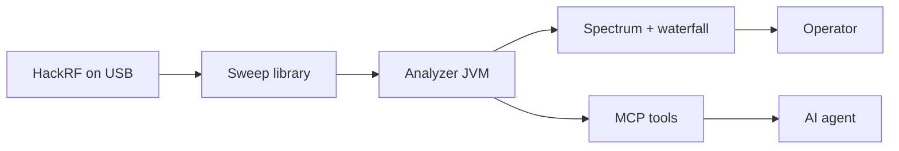

# MCP — AI agents on the live sweep

This is **HotIron**: a HackRF desktop with a Model Context Protocol (MCP) interface. You watch the plot. A local agent (Grok, Claude, Cursor, or anything that speaks MCP) **copies the RF bins**, on the **same JVM**, without opening a second rig.



Start it with `make mcp`. Point the agent at `scripts/mcp-hotiron-proxy.py`. Ask what is on the air.

## What an agent can answer

| Question | Tool |
|---|---|
| Where is the peak, and how loud is the noise? | `spectrum_summary` |
| Give me the filled bins (optional `maxPoints`, `minDbm`) | `spectrum_snapshot` |
| What radio is attached (board, serial, firmware, USB API)? | `radio_identity` |
| What is the radio vs display config (range, FFT, gain, `autoSweep`, `radioMode`, `tvChannel`, `tvLocked`)? | `sweep_config` |
| Park Watch on a US ATSC channel (2–36) | `tv_watch` |
| What is the live local RF spectrum around the TV channel being watched? | `tv_spectrum` |
| Where is ATSC Watch failing (IQ, segment/field sync, RS, PAT, FFmpeg)? | `tv_debug` |
| How have those ATSC stages changed over recent samples? | `tv_debug_history` |
| Park Listen on a US FM dial (88.1–107.9) | `fm_listen` |
| Which US FM dial hits are live right now? | `fm_stations` |
| What is the live local RF spectrum around the station being heard? | `fm_spectrum` |
| What is occupying the window (width, fraction, Wi-Fi ch)? | `spectrum_occupancy` |
| How did peak/noise/occupancy move over the last few seconds? | `spectrum_history` |

Hop holes are **omitted**, not reported as −150 dBm. Snapshots are sampled at most **10 Hz**. `spectrum_history` returns **summaries** from the ring (~20 s), not full bin arrays, and starts a new series when the MHz/FFT window changes. Occupancy is deterministic (noise+8 dB, merge adjacent bins); Wi-Fi views may label `ch 6`. `tv_watch` and `fm_listen` park the same exclusive RF path the operator uses (US TV ch 2–36, or FM 88.1–107.9). Gain and sweep range stay operator-only. `sweep_config` includes `radioMode`, `listenMHz`, `tvChannel`, `tvLocked`, `tvSnrDb`, `tvPackets`, and display `autoSweep`. `fm_spectrum` is the live ±2 MHz dBFS view derived from Listen's parked IQ; `tv_spectrum` is the corresponding ±8 MHz Watch view. Neither opens another USB path. `tv_debug` labels the current failing stage (`no_segment_sync`, `no_field_sync`, `rs_unusable`, `no_pat`, `waiting_rs_health`, then FFmpeg-side `ffmpeg_missing` / `ffmpeg_exited` / `ffmpeg_blocked` / `no_pmt` / `no_video_pid` / `no_video_pes` / `ffmpeg_waiting` / `picture`) and exposes queue, AGC, equalizer, packet-error, and an `ffmpeg` object (process alive/exit, TS bytes offered vs written, queue drops, stdout/partial-frame, last stderr, PAT/PMT/video PID counts). `tv_debug_history` returns up to 200 recent diagnostic samples. The same FFmpeg counters are on the 2 s `ATSC watch:` console line. While listening or watching, `spectrum_snapshot` / `spectrum_history` / `spectrum_occupancy` follow the parked-IQ FFT (dBFS magnitudes in the `dbm` fields) and start a new history series when the dial or TV channel moves. Wideband `fm_stations` stay stale; use `fm_spectrum` / `tv_spectrum` for the full local bins.

## Start

The GUI owns USB. MCP is opt-in on that process:

```bash
make mcp                 # GUI + listen on 127.0.0.1:8765
# or
./src/hotiron/build/hotiron/hotiron.sh --mcp
# optional: --mcp-port=8765   --mcp-stdio
```

Client config (stdio proxy; the analyzer must already be listening):

```json
{
  "mcpServers": {
    "hotiron": {
      "command": "python3",
      "args": ["scripts/mcp-hotiron-proxy.py"],
      "env": { "HOTIRON_MCP_PORT": "8765" }
    }
  }
}
```

Run the proxy from the repo root (or pass an absolute path to the script).

## Why this shape

- **One radio.** A second `hackrf_sweep` would fight the GUI for USB.
- **Same data as the plot.** The store is filled from `onFullSweepProcessed`, not from screenshots or log scraping.
- **Safe for agents.** JSON-RPC on localhost / stdio. No LAN listen in v1. No USB restart from a snapshot tool.
- **Operator-first defaults.** Auto gain, auto-scale dB, and a waterfall time axis so humans and agents see a usable band.

The operator sidebar (and the status-bar **MCP** field) shows bind address, connected clients (`initialize.clientInfo.name`), and the last tool call. **MCP off** means this process was started without `--mcp`.

Implementation: `hotiron.mcp` (`SpectrumSnapshotStore`, `SpectrumMcpServer`, `SpectrumMcpTools`) plus `McpStatus` for the UI. Writes go through `FmListenHook` / `TvWatchHook` on the EDT (same `AnalyzerSettings` as the operator). Snapshot tools only read the store. Design notes: [architecture.md](architecture.md). Operator UI: [operator.md](operator.md).
