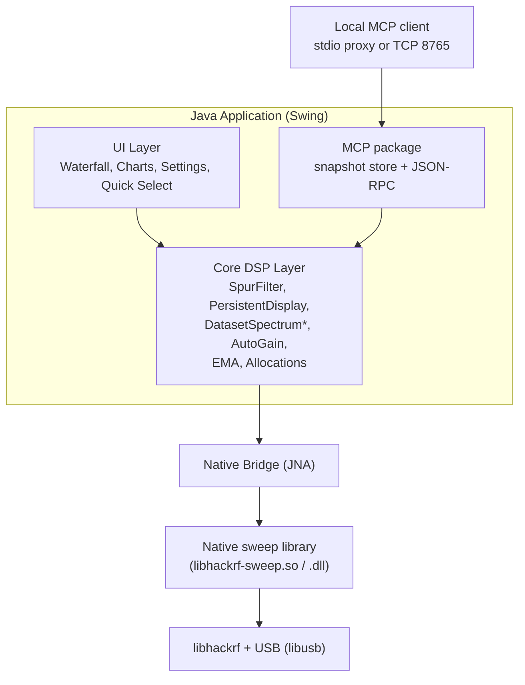
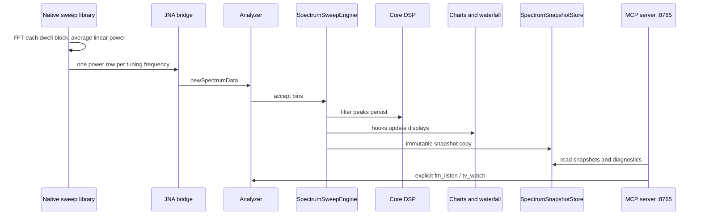
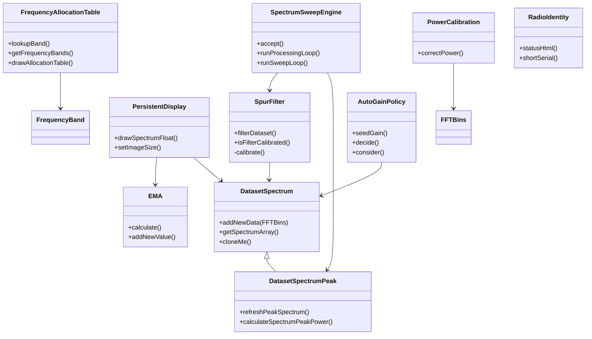
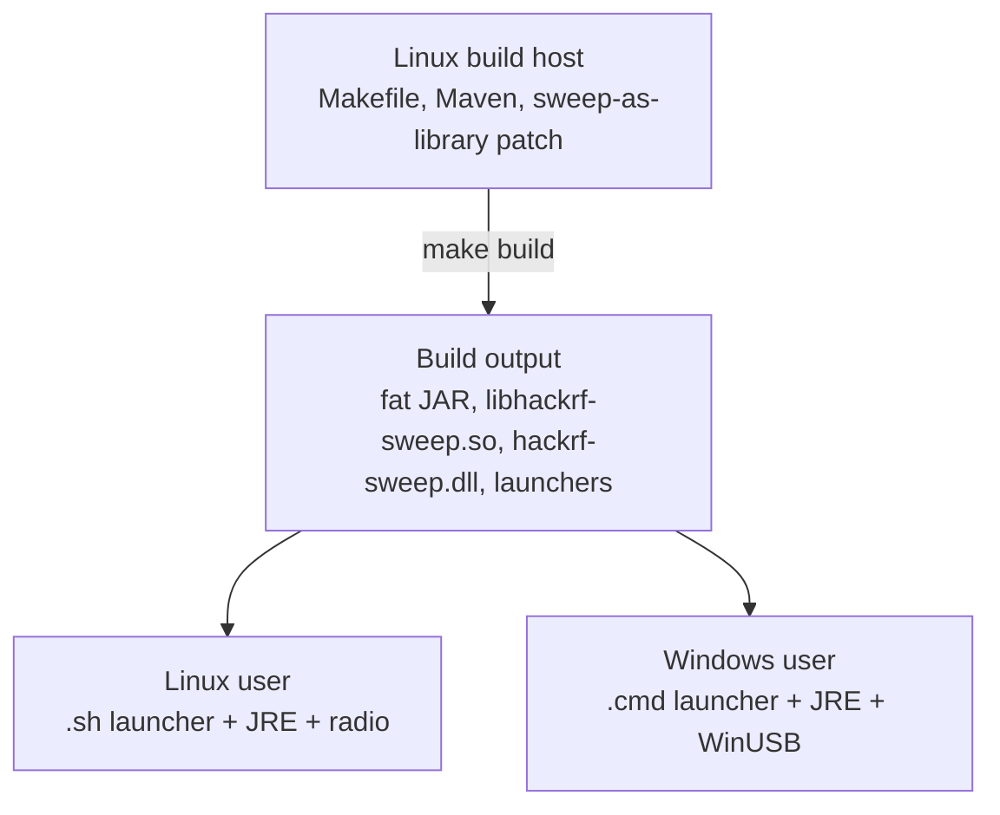
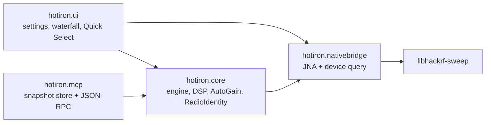

# Architecture

This is a desktop HackRF analyzer whose **MCP server lives in the same JVM as the GUI**. Agents talk to `hotiron.mcp`; they never open USB. Operator UI and agent tools share `SpectrumSweepEngine` + `SpectrumSnapshotStore`. Product-facing MCP notes: [agents.md](agents.md).

## High-Level Overview

## Key Components

### Core DSP (`hotiron/core/`)
- `DatasetSpectrum`, `DatasetSpectrumPeak`
- `SpectrumSweepEngine`, `SpurFilter`, `PersistentDisplay`, `SpectrumPowerScale`
- `AnalyzerSettings` (all `HackRFSettings` model values; radio vs display)
- `AutoGainPolicy` (LNA then VGA; display policy, writes radio gain)
- `FrequencyRange.forInterleavedNativeSweep()` (±10 MHz pad so FM 88–108 is filled)
- `FrequencyAxis`, `BandMark`, `WifiBandLayer`, `FmBandLayer` (plot overlays do not invent their own MHz↔pixel map)
- `EMA`, `FFTBins`, `PowerCalibration`, `RadioIdentity`
- Frequency allocation tables

These are the best candidates for unit testing (and have the majority of our test coverage).

### Native Integration
- `src-c/0001-hackrf_sweep-to-library-conversion-v2026.01.3.patch` — Turns the upstream `hackrf_sweep` tool into a reusable library. `num_samples` requests 8192-sample firmware dwell blocks; `sweep_power_average` runs one FFT per block and averages linear power before emitting one row per tuning frequency.
- `src-c/hackrf_fm.c` — parked IQ RX (`hackrf_start_rx`) for listen/watch. First-party; not a second sweep patch.
- `src-c/atsc/` — ATSC 1.0 RX (`atsc_rx_create` / `process` / `destroy`): GNU Radio `gr-dtv` inner loops + Phil Karn `libfec`, no GR runtime.
- `HackRFSweepNativeBridge.java` / `HackRFFmNativeBridge.java` + hand-maintained `HackrfSweepLibrary.java` (`make jnabridge` does not regenerate it)
- The build process resets the hackrf submodule to `HACKRF_SDK_PIN` (v2026.01.3) and applies the patch.
- Sweep, FM listen, and ATSC watch are exclusive. `WfmDemodulator` (Java) turns int8 IQ into 48 kHz mono PCM. FM Listen also FFTs the same parked 4 MS/s IQ into a local ±2 MHz RF chart and `fm_spectrum` MCP snapshot while retaining the 0–16 kHz audio waterfall. Watch reuses parked IQ at 16 MS/s through an 8 MHz analog filter (`hackrf_fm_lib_*`, `TvChannelPlan`); that same IQ drives the local ±8 MHz RF chart, `tv_spectrum`, and VIDEO waterfall. UHF auto gain starts at LNA 40 dB + VGA 22 dB. `IqSpectrum` supplies both parked-IQ FFTs without another USB path. Decoded frames (IQ preview, then MPEG-2) go to a 16:9 box on `TvTunerPanel`. Native `atsc_rx_*` in `libhackrf-sweep` (vendored GNU Radio `gr-dtv` 8VSB + libfec) emits MPEG-TS; `MpegTsPlayer` runs host `ffmpeg` for MPEG-2 `bgr24` frames and AC-3 → 48 kHz PCM on `AudioSink`. `tv_debug` / `tv_debug_history` expose stage diagnostics.

### UI Layer
- Swing + FlatLaf + JFreeChart.
- `WaterfallPlot` + `WaterfallTimeScale` (left gutter, newest at the top). Palette follows the live dB window when auto-scale is on. History is kept across gain-only USB restarts (`DatasetSpectrum.sameAxisAs`).
- `HackRFSweepSettingsUI`, Quick Select (`QuickSelectPreset`), `SweepStatusBar`, radio identity (board / serial / firmware), MCP status (`McpStatus`). Spectrum overlays share `FrequencyAxis` + `BandHeaderPainter`: Wi-Fi (`WifiBandLayer`), live US FM (`FmBandLayer` + `FmStationTracker`), US TV (`TvBandLayer` + `TvChannelOverlay`), and zoomed-out Quick Select (`QuickSelectBandLayer`). Frequency zoom (`SpectrumZoom` + `SpectrumZoomHistory`) retunes the sweep like a Grafana time-range drag. Listen and Watch both keep `WaterfallPlot` (AUDIO / VIDEO banners) at the same split.

### MCP (`hotiron/mcp/`)
Model Context Protocol on the **same JVM** as the GUI (no second USB open). `SweepUiHooks.onFullSweepProcessed` copies filled bins into `SpectrumSnapshotStore` at ≤10 Hz. `SpectrumMcpServer` speaks JSON-RPC (`Content-Length` or one object per line) on stdio or `127.0.0.1:8765` (`--mcp` / `make mcp`) and publishes `McpStatus` (bind, clients, last tool) to the sidebar and status bar. Read tools: `spectrum_summary`, `spectrum_snapshot`, `radio_identity`, `sweep_config` (radio vs display, including `radioMode` / `listenMHz` / `tvChannel` / `tvLocked`), `fm_stations`, `fm_spectrum`, `tv_spectrum`, `spectrum_occupancy`, `spectrum_history`, `tv_debug`, `tv_debug_history`. Writes: `fm_listen` (US FM dial) and `tv_watch` (US ATSC ch 2–36). Hop holes are omitted. Stdio clients use `scripts/mcp-hotiron-proxy.py`.

### Build System
- Root `Makefile` — convenience targets (`make help`, `make test`, `make start`, etc.).
- `src/hotiron/Makefile` — the real engine (cross-compiles natives + invokes Maven).
- Maven (`pom.xml`) — Java compilation, dependency management, fat JAR assembly. Layout: [develop.md — Module layout](develop.md#module-layout-srchotiron).

## Design Goals

- Keep the performance-critical sweep loop in optimized native code.
- Make the Java side as "pure" as possible for the signal processing so it can be unit tested.
- Support both Linux native development and Windows end-users from a single build.

## Data Flow (Simplified)

## Testing Strategy

- Unit tests live under `src/test/java` and focus on `core/`.
- No hardware is required for the unit test suite.
- Graphics and time-dependent behavior use reflection to control internal state where necessary.

See [develop.md](develop.md) and the testing section in the root [README](https://github.com/chris-piekarski/hotiron) for more.

## Core DSP Class Diagram (Simplified)

## Build to user

## Java Package Structure (Core Focus)

