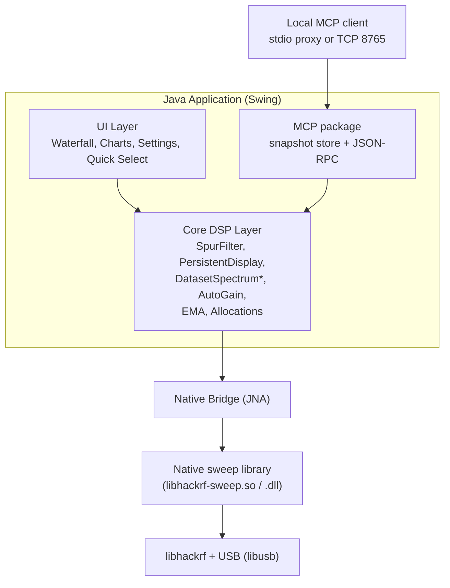
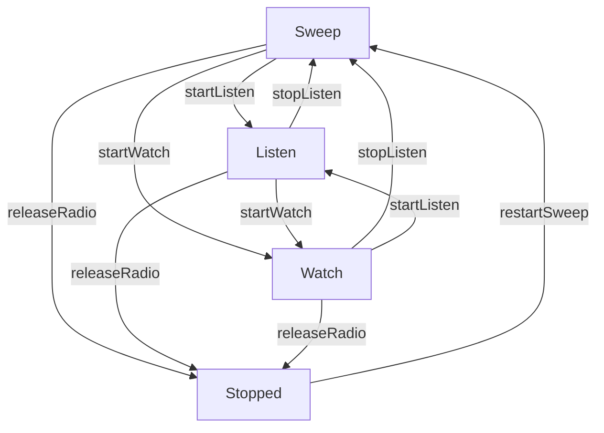
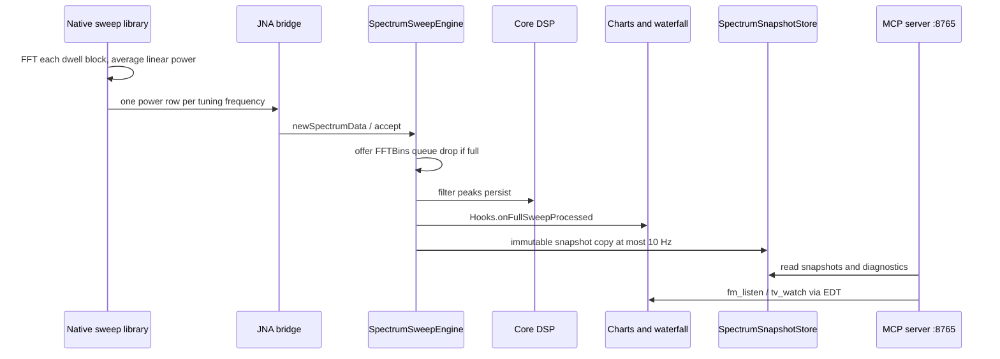
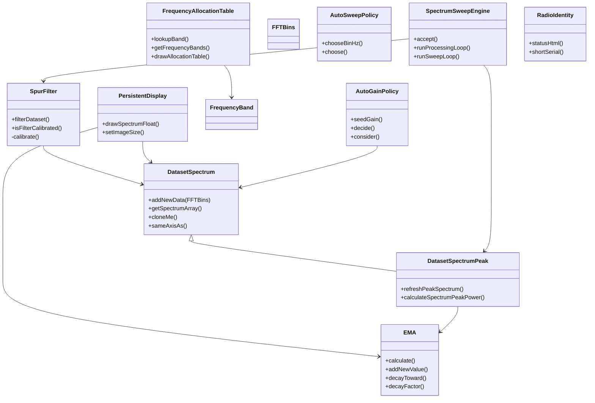
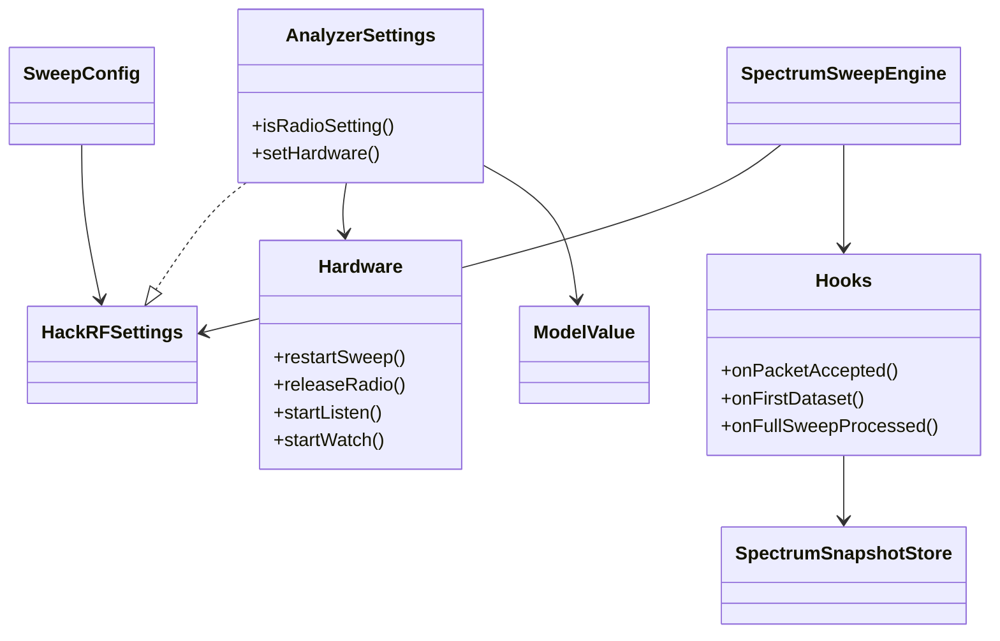
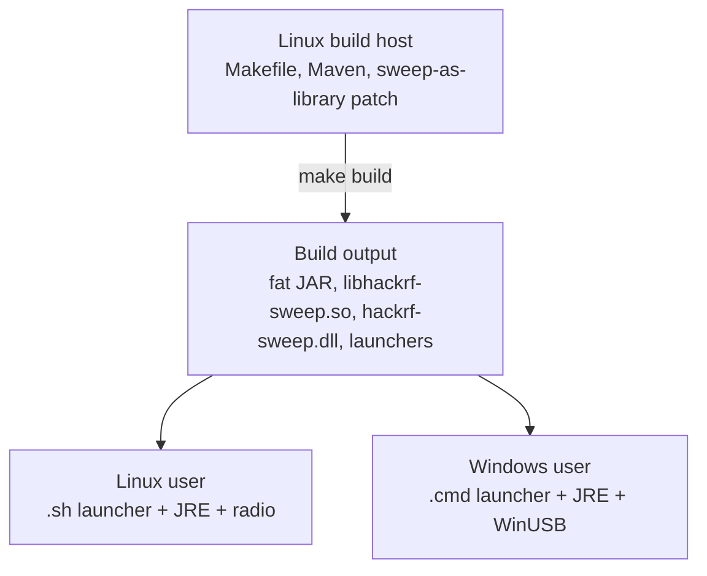
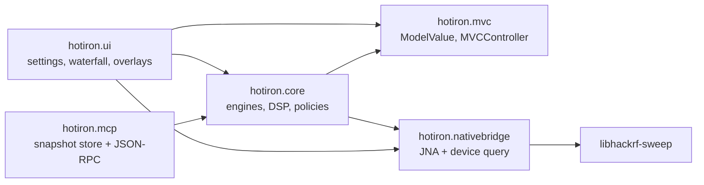

# Architecture

This is a desktop HackRF analyzer whose **MCP server lives in the same JVM as the GUI**. Agents talk to `hotiron.mcp`; they never open USB. Operator UI and agent tools share `SpectrumSweepEngine` + `SpectrumSnapshotStore`. Product-facing MCP notes: [agents.md](agents.md).

Three constraints drive the layout:

1. **One radio.** Sweep, Listen, and Watch are exclusive. Native start is blocking; Java must stop-and-join before switching modes.
2. **Keep USB and FFT in C; keep policy in Java.** `hotiron.core` is unit-testable without hardware (`make test` never needs a HackRF).
3. **Same RF data for operator and agent.** MCP copies filled bins from the processing hook; it does not scrape the plot or open a second device.

## High-Level Overview

`HotIron` is the composition root: it constructs `AnalyzerSettings`, injects `Hardware`, wires `SpectrumSweepEngine` with `SweepUiHooks`, owns `FmListenEngine` / `TvWatchEngine`, and optionally starts MCP. Engines, settings, overlays, and the snapshot store are extracted; chart construction and mode threads still live on that class.

## Key Components

### Core DSP (`hotiron/core/`)
- `DatasetSpectrum`, `DatasetSpectrumPeak` (`sameAxisAs` keeps waterfall history across gain-only USB restarts)
- `SpectrumSweepEngine`, `FmListenEngine`, `TvWatchEngine` — USB callback only enqueues; DSP runs on a worker
- `SpurFilter`, `PersistentDisplay`, `SpectrumPowerScale`, `IqSpectrum`
- `AnalyzerSettings` (all `HackRFSettings` model values; radio vs display via `isRadioSetting`)
- `SweepConfig` — immutable snapshot of **radio** fields only (range, FFT, samples, LNA/VGA, antenna, CLKOUT, serial)
- `RadioMode` — derived (`stopped` / `sweep` / `listen` / `watch`), not stored
- `AutoGainPolicy` (LNA then VGA; display policy, writes radio gain)
- `FmListenGainPolicy` / `TvWatchGainPolicy` — parked-IQ seeds (Listen adds IF so a 200 kHz station uses the 8-bit ADC; Watch UHF starts at LNA 40 + VGA 22, Auto Watch enables the RF amp for that session, and IF keeps trimming toward ~0.5 RMS)
- `BandScanSession` — FM/TV/NFC **Scan** dwells each window after the first live sweep (TV: VHF then UHF; NFC: 12–15 then 27.12 / 40.68) so **Seek** jumps a pinned station list (NFC has no Seek list)
- `AutoSweepPolicy` (FFT Bin + samples from span; display policy, writes radio FFT/samples; hysteresis so pan does not thrash)
- `FrequencyRange.forInterleavedNativeSweep()` (±10 MHz pad so FM 88–108 is filled)
- `FrequencyAxis`, `BandMark`, `WifiBandLayer`, `FmBandLayer`, `TvBandLayer`, `NfcBandLayer` (plot overlays do not invent their own MHz↔pixel map)
- Channel catalogs + trackers: `FmChannelPlan` / `FmStationTracker`, `TvChannelPlan` / `TvStationTracker`, `WifiChannelPlan`, `NfcBandPlan` / `NfcActivityTracker`
- `EMA`, `FFTBins`, `RadioIdentity`, `AudioSink` / `AudioSinks`
- Frequency allocation tables

These are the best candidates for unit testing (and have the majority of our test coverage).

### Native Integration
- `src-c/0001-hackrf_sweep-to-library-conversion-v2026.01.3.patch` — Turns the upstream `hackrf_sweep` tool into a reusable library. `num_samples` requests 8192-sample firmware dwell blocks; `sweep_power_average` runs one FFT per block and averages linear power before emitting one row per tuning frequency.
- `src-c/hackrf_fm.c` — parked IQ RX (`hackrf_start_rx`) for listen/watch. First-party; not a second sweep patch.
- `src-c/atsc/` — ATSC 1.0 RX (`atsc_rx_create` / `process` / `destroy`): GNU Radio `gr-dtv` inner loops + Phil Karn `libfec`, no GR runtime. Pipeline: RRC → FPLL → DC blocker → AGC → sync → field-sync checker → equalizer → Viterbi → deinterleaver → RS → derandomizer.
- `HackRFSweepNativeBridge.java` / `HackRFFmNativeBridge.java` + hand-maintained `HackrfSweepLibrary.java` (JNAerator is not in the build; keep in sync with `src-c/hackrf_sweep.h`, `hackrf_fm.h`, `atsc_rx.h`)
- The build process resets the hackrf submodule to `HACKRF_SDK_PIN` (v2026.01.3) and applies the patch.
- Sweep, FM listen, and ATSC watch are exclusive. `WfmDemodulator` (Java) turns int8 IQ into 48 kHz mono PCM. FM Listen also FFTs the same parked 4 MS/s IQ into a local ±2 MHz RF chart and `fm_spectrum` MCP snapshot while retaining the 0–16 kHz audio waterfall. Watch reuses parked IQ at 16 MS/s through an 8 MHz analog filter (`hackrf_fm_lib_*`, `TvChannelPlan`); that same IQ drives the local ±8 MHz RF chart, `tv_spectrum`, and VIDEO waterfall. `IqSpectrum` supplies both parked-IQ FFTs without another USB path; those rows go through `DatasetSpectrumPeak` so peak/persistence/`spectrum_history` stay live. Decoded frames (IQ preview, then MPEG-2) go to a 16:9 box on `TvTunerPanel`. Native `atsc_rx_*` in `libhackrf-sweep` emits MPEG-TS; `MpegTsPlayer` runs host `ffmpeg` for MPEG-2 `bgr24` frames and AC-3 → 48 kHz PCM on `AudioSink`. `tv_debug` / `tv_debug_history` expose stage diagnostics including FFmpeg/TS decode counters.

### UI Layer
- Swing + FlatLaf + JFreeChart. Settings widgets bind through `hotiron.mvc` (`ModelValue` + `MVCController`); do not add new model fields on the JFrame.
- `WaterfallPlot` + `WaterfallTimeScale` (left gutter, newest at the top). Palette follows the live dB window when auto-scale is on. History is kept across gain-only USB restarts (`DatasetSpectrum.sameAxisAs`). Chart refresh is capped at 30 fps even when a narrow window finishes hundreds of sweeps per second.
- `HackRFSweepSettingsUI`, Quick Select (`QuickSelectPreset`), `SweepStatusBar`, radio identity (board / serial / firmware), MCP status (`McpStatus`). Spectrum overlays share `FrequencyAxis` + `BandHeaderPainter`: Wi-Fi (`WifiBandLayer`), live US FM (`FmBandLayer` + `FmStationTracker`), US TV (`TvBandLayer` + `TvChannelOverlay`), NFC / 13.56 (`NfcBandLayer` + `NfcActivityTracker` + `NfcHud`), and zoomed-out Quick Select (`QuickSelectBandLayer`). Header hit-test is how click-to-listen / click-to-watch / NFC Scan works. Frequency zoom (`SpectrumZoom` + `SpectrumZoomHistory`) retunes the sweep like a Grafana time-range drag. Listen and Watch both keep `WaterfallPlot` (AUDIO / VIDEO banners) at the same split.

### MCP (`hotiron.mcp`)
Model Context Protocol on the **same JVM** as the GUI (no second USB open). `SweepUiHooks.onFullSweepProcessed` copies filled bins into `SpectrumSnapshotStore` at ≤10 Hz. `SpectrumMcpServer` speaks JSON-RPC (`Content-Length` or one JSON object per line) on stdio or `127.0.0.1:8765` (`--mcp` / `make mcp`) and publishes `McpStatus` (bind, clients, last tool) to the sidebar and status bar. Read tools: `spectrum_summary`, `spectrum_snapshot`, `radio_identity`, `sweep_config` (radio vs display, including `radioMode` / `listenMHz` / `tvChannel` / `tvLocked` / `autoSweep`), `fm_stations`, `nfc_activity`, `fm_spectrum`, `tv_spectrum`, `spectrum_occupancy`, `spectrum_history`, `spectrum_history_bins`, `tv_debug`, `tv_debug_history`. Writes: `fm_listen` (US FM dial) and `tv_watch` (US ATSC ch 2–36) set the same `AnalyzerSettings` the operator uses (EDT), then park. Snapshot tools must not restart USB. Hop holes are omitted, not reported as −150 dBm. Occupancy (`SpectrumOccupancy`) is deterministic on filled bins (noise+8 dB). Stdio clients use `scripts/mcp-hotiron-proxy.py`.

### Build System
- Root `Makefile` — convenience targets (`make help`, `make test`, `make start`, etc.).
- `src/hotiron/Makefile` — the real engine (cross-compiles natives + invokes Maven).
- Maven (`pom.xml`) — Java compilation, dependency management, fat JAR assembly. Layout: [develop.md — Module layout](develop.md#module-layout-srchotiron).

## Design Goals

- Keep the performance-critical sweep loop in optimized native code.
- Make the Java side as "pure" as possible for the signal processing so it can be unit tested.
- Support both Linux native development and Windows end-users from a single build.

## Exclusive USB

`RadioMode` is derived, not stored (`RadioMode.of(settings)`): released → `stopped`; else parked + `ListenService.TV` → `watch`; parked FM → `listen`; otherwise `sweep`. Native headers document the same exclusive contract (`hackrf_sweep.h`, `hackrf_fm.h`).

Mode changes go through `AnalyzerSettings.Hardware` into `RadioSession.applyNow()`.

## Data Flow

Three pipelines, one USB owner. Native interleaved hops export 5 MHz slices with holes. `FrequencyRange.forInterleavedNativeSweep()` pads ±10 MHz so the operator window is actually filled; dataset and axis stay on the requested range.

**Listen.** Native parks at 4 MS/s IQ. The libusb callback only `FmListenEngine.offerIq()`. Demod, audio FFT, and local ±2 MHz `IqSpectrum` run on `fm-wfm-demod`. The first 200 ms after sweep→4 MS/s is dropped (unlocked PLL/DC). Chart uses the IQ FFT; waterfall is 0–16 kHz audio.

**Watch.** Same parked-IQ bridge at 16 MS/s / 8 MHz analog filter. `TvWatchEngine` feeds native `atsc_rx_process`, then `MpegTsPlayer`. The same IQ drives the local ±8 MHz chart, VIDEO waterfall, and `tv_spectrum`. Queue overflow discards stale backlog and recreates the native decoder (see [plans/atsc-tv-watch.md](plans/atsc-tv-watch.md)).

## Design structure

This is how the pieces stay testable and exclusive. Types, not a framework.

### Observable settings (MVC)

`hotiron.mvc` is a small property model, not Swing `AbstractTableModel`.

- **Model:** `ModelValue<T>` (plus `ModelValueInt` / `ModelValueBoolean`) holds a named value and notifies listeners on change. Set is a no-op if equal. Bounded ints throw if out of range.
- **View:** Swing widgets in `HackRFSweepSettingsUI`.
- **Controller:** `MVCController` binds checkbox/slider/spinner/combo both ways, with a `disableViewListeners` flag so view updates do not re-enter the model. View writes marshal onto the EDT.

`AnalyzerSettings` implements `HackRFSettings` and **owns every `ModelValue`**. Radio fields (`isRadioSetting`) restart USB after debounce/coalesce. Display fields (peaks, auto-scale, palette, waterfall) only repaint. Auto-gain and Auto-sweep are **display policies that write radio fields**. `RadioCoordinator.bind()` is the only listener table that may restart USB; Auto writes go through `applyAutoSweep` / `applyAutoGain` so they do not look like spinner overrides. Manual spinner changes turn Auto off. MCP `fm_listen` / `tv_watch` set the same model and park via `startListen` / `startWatch` (EDT), then dial/channel retunes flow through the coordinator.

### Ports (hooks, no DI container)

Three ports keep `core` and `mcp` free of Swing and USB:

| Port | Production implementor | Null / test stand-in |
|---|---|---|
| `AnalyzerSettings.Hardware` | `HotIron` (restart, release, listen, watch, list serials) | `Hardware.NOOP` |
| `RadioCoordinator.Usb` | `RadioSession.applyNow` / `applyDebounced` | counting fake in `RadioCoordinatorTest` |
| `RadioSession.Driver` | `HotIron` stop/join + start sweep/listen/watch | counting fake in `RadioSessionTest` |
| `SpectrumSweepEngine.Hooks` | `HotIron.SweepUiHooks` (chart, waterfall, snapshot publish, auto-gain) | `NOOP_HOOKS` |
| `SpectrumMcpTools.FmListenHook` / `TvWatchHook` | EDT lambdas that set dial/channel and call `startListen` / `startWatch` | `null` → tool reports unavailable |

`FakeHackRFSettings` wraps `AnalyzerSettings` plus call counters so UI tests never construct a JFrame or load JNA.

### Producer–consumer queues

USB callbacks must stay short. Every engine **offers** a copy into an `ArrayBlockingQueue`; a worker **takes** and does DSP; overflow **drops** and increments a counter.

| Path | Queue | Worker |
|---|---|---|
| Sweep | 1000 `FFTBins` | `SpectrumSweepEngine` processing thread |
| Listen IQ | 8 chunks | `fm-wfm-demod` |
| Watch IQ | 128 chunks | `atsc-8vsb` (ATSC cannot skip if it wants RS lock) |

### Policy objects

Policies are `final` classes with private constructors and static methods. They do not hold USB. Time is injected (`nowMs`, `LongSupplier`) so tests do not sleep.

| Policy | Decision |
|---|---|
| `GainPolicy` | Split total gain into LNA-then-VGA (HackRF hardware rule) |
| `AutoGainPolicy` + `Loop` | Sweep AGC: seed by band, hysteresis, peak-hold half-life, settle after apply; one Wi-Fi packet is not clip |
| `FmListenGainPolicy` | Sweep seed + 16 dB IF |
| `TvWatchGainPolicy` | UHF watch seed (LNA 40 + VGA 22) |
| `AutoSweepPolicy` | Finest FFT bin with ≤~4000 dataset points, always 8192 samples, keep current bin while length stays 1500–6000 |
| `RadioCoordinator` | Operator vs Auto vs parked retune; Auto writes run as `Source.AUTO_POLICY` so they do not look like spinner overrides |
| `RadioSession` | Exclusive USB queue, debounce, sweep vs Listen vs Watch at start |
| `SweepFramePolicy` | Chart ≤30 fps, axis-history, Auto-gain eligibility (off while parked or scanning) |
| `SweepLiveLoop` | One full-sweep tick: axis, 10 Hz detect+MCP, then paint-gated detect/scan/AGC/paint |
| `SpurFilter` | Calibrate across N sweeps, then subtract; recalibrate on axis change |
| `SpectrumOccupancy` | Emitters above noise+8 dB on filled bins; no USB |

### Shared frequency map

`FrequencyAxis` is the only MHz↔pixel map. Zoom-drag, waterfall, and every overlay use it. Layers are pure functions of axis + domain data (`WifiBandLayer`, `FmBandLayer`, `TvBandLayer`, `NfcBandLayer`, `QuickSelectBandLayer`) and emit `BandMark`s. UI overlays are thin: `FrequencyAxis.fromArea` → layer `marks()` → `BandHeaderPainter.paint`. Do not add a second MHz↔pixel map. NFC Quick Select is **12–15 MHz** so Type A/B sidebands are on-screen; PHY notes are in [nfc.md](nfc.md).

`FmStationTracker` / `TvStationTracker` / `NfcActivityTracker` add temporal hysteresis so a one-sweep flash is not labeled.

### Immutable snapshots

`SpectrumSnapshot`, `SweepConfig`, `BandMark`, `FrequencyAxis`, `FFTBins`, `AutoGainPolicy.Observation`, `AutoSweepPolicy.Choice` are immutable (often `public final` fields, cloned arrays).

`SpectrumSnapshotStore` is a single-writer, many-reader ring:

- writer: `SweepUiHooks.onFullSweepProcessed` (and parked-IQ publishers)
- readers: MCP tools, status bar, `sweep_config`
- cap: 10 Hz (`MIN_PUBLISH_INTERVAL_MS = 100`)
- ring: ~20 s of **summaries**, not full bins; a new series starts when the MHz/FFT window changes
- hop holes omitted

`XYSeriesImmutable` stores primitive `float[]` so the 30 fps chart path does not allocate JFreeChart `XYDataItem`s.

### Native bridge and adapters

Java `HackRFSweepNativeBridge` / `HackRFFmNativeBridge` vs C `hackrf_sweep_lib_*` / `hackrf_fm_lib_*`. One shared library (`libhackrf-sweep`); the FM bridge touches the sweep class so JNA load happens once.

`MpegTsPlayer` adapts MPEG-TS bytes to host `ffmpeg` and keeps decode counters (`Stats` + `MpegTsProbe`) for `tv_debug`. Watch only starts that player after a healthy Reed-Solomon window and maps the PMT video/audio PIDs. `AudioSinks.openPlayback()` is Java Sound, then Pulse (WSL), then `RecordingAudioSink`. Unit tests inject `AudioSink` and never open a mixer.

### Exclusive USB

`RadioSession` owns the last-launch-wins apply queue and frequency debounce (`SweepConfig.FREQUENCY_APPLY_DEBOUNCE_MS` = 120 ms). After stop, it starts sweep, Listen, or Watch from `settings.radioMode()` (`RadioMode.of`). `Stop` aborts with a bounded join so the EDT cannot hang; a queued apply after Stop does not start. Auto writes run as `RadioCoordinator.Source.AUTO_POLICY` so FFT/gain listeners do not double-restart or turn Auto off.

### Cross-cutting

- **Radio vs display.** Changing a radio `ModelValue` restarts USB (after debounce/coalesce). Changing a display `ModelValue` only repaints.
- **EDT isolation.** Native callbacks and MCP I/O never run on the Swing EDT. Chart updates, MCP `fm_listen`/`tv_watch`, and `MVCController` view writes marshal with `invokeLater` / `invokeAndWait`.
- **Shared IQ, no second USB path.** Parked Listen/Watch FFT (`IqSpectrum`) and MCP `fm_spectrum` / `tv_spectrum` reuse the int8 IQ the demod/ATSC pipeline already has.

## Testing Strategy

- Unit tests live under `src/test/java` and focus on `core/`.
- No hardware is required for the unit test suite (`make test`). Hardware ITs (`*IT`, `@Tag("hardware")`) run only under `make test-hw`.
- Graphics and time-dependent behavior use reflection to control internal state where necessary.
- Stand-ins: `FakeHackRFSettings`, `Hardware.NOOP`, `NOOP_HOOKS`, `RecordingAudioSink`, synthetic `FFTBins` / `DatasetSpectrum`, injected `nowMs`.

See [develop.md](develop.md) and the testing section in the root [README](../README.md) for more.

## Core DSP Class Diagram (Simplified)

Peak hold snaps up to a new high, then `EMA.decayToward` the live bin with the operator half-life (`0` follows live). Chart holes are skipped. Persistent display uses the same half-life factor on wall-clock `dt` so a sweep-rate change does not retune the fade. Listen/Watch parked-IQ FFTs go through the same `DatasetSpectrumPeak` + overlay + snapshot ring; the AUDIO/VIDEO waterfall stays the parked strip. A Quick Select, FM/TV mode change, or dial/channel hop calls `beginFlush` (~350 ms, 55 ms half-life) so the old glow does not sit on the new axis.

## Build to user

## Java Package Structure

Dependency direction is downward. UI and MCP both depend on `core`. `core` uses `mvc` for `ModelValue` and `nativebridge` only through engines. Overlay **policy** lives in `core`; **paint** lives in `ui`.

## Where to start reading

1. `HackRFSettings` + `AnalyzerSettings` — the model and radio/display split
2. `RadioCoordinator` — USB apply from operator / Auto / MCP dial (tests, no JFrame)
3. `RadioSession` — exclusive queue, debounce, mode at start (tests, no JNA)
4. `SpectrumSweepEngine` — producer/consumer + hooks
5. `SweepLiveLoop` — detect / scan / 10 Hz MCP publish / 30 fps paint (`SweepFramePolicy`)
6. `HotIron` driver — native start/stop; paint stays on the frame
7. `FmListenEngine` / `TvWatchEngine` — parked IQ variants of the same queue pattern
8. `FrequencyAxis` + `BandMark` + one `*BandLayer` — overlay architecture
9. `SpectrumSnapshotStore` + `SpectrumMcpTools` — agent read model and the two write hooks
