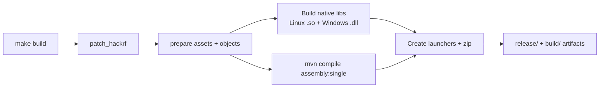

# Building

This project uses a custom Makefile (with Maven under the hood) for a unified Linux + Windows cross-build experience.

**Strongly recommended**: Use `make help` at any time — it is the source of truth for available targets and is kept up to date.

## Quick Build (from repo root)

```bash
make help          # Explore all targets
make deps          # Install all required packages (Ubuntu/Debian)
make build         # Full build (natives + JAR + release zip)
make start         # Build (if needed) + run the Linux app
make mcp           # GUI + MCP for AI agents (127.0.0.1:8765) — see docs/agents.md
```

This is the easiest path on Ubuntu/Debian.

## Build Pipeline



## Detailed Requirements (Ubuntu recommended)

```bash
sudo apt install \
  build-essential \
  maven \
  git \
  libusb-1.0-0-dev \
  libfftw3-dev \
  libfftw3-bin \
  openjdk-21-jdk \
  mingw-w64 \
  zip \
  ffmpeg \
  libpulse0
```

`build-essential` supplies GCC and G++ (C++17 is required by the ATSC native code). The HackRF submodule must already be initialized (`git clone --recurse-submodules` or `git submodule update --init --recursive`); the build resets it to the pinned version and applies the patch, but does not initialize a missing submodule.

## Common Targets

### From Repository Root

| Target          | Description                          |
|-----------------|--------------------------------------|
| `build`         | Full build (delegates to subdir)    |
| `clean`         | Remove all build artifacts          |
| `test`          | Run unit tests                      |
| `test-hw`       | Hardware ITs (skips if no HackRF)   |
| `info`          | HackRF USB, app SDK/API, firmware updates |
| `list-devices`  | Alias for `info`                    |
| `firmware-update` | Official GSG flash (dry-run; `CONFIRM=1` writes) |
| `udev`            | Install persistent HackRF udev rules (sudo) |
| `lint`          | Maven compile check                 |
| `stats`         | Refresh [docs/stats.md](stats.md) (LOC, packages, tests, git) |
| `mermaid`       | Parse-check all first-party Mermaid diagrams |
| `start`         | Launch the Linux app                |
| `run`           | Alias for `start`                   |

### Inside `src/hotiron/`

Run `make help` inside this directory for advanced / low-level targets:

- `all` (default)
- `jnabridge` — no-op; `HackrfSweepLibrary.java` is hand-maintained
- `patch_hackrf` — re-apply the library-mode patch
- `clean`, `prepare`, etc.

## Output Locations

After a successful build you will find:

- `src/hotiron/build/hotiron/` — runnable tree with launcher + `lib/`
- `release/` — cross-platform release zip (Linux and Windows launchers/native libraries, if `zip_file` ran)

## Cross-Compilation Notes

- Linux build produces both the Linux `.so` **and** the Windows `.dll` (using mingw-w64).
- The hackrf submodule is automatically reset to v2026.01.3 and patched during build (`HACKRF_SDK_PIN` in `src/hotiron/Makefile`).
- The Java fat JAR is built with Maven (`maven-assembly-plugin`); there is no Ant or Eclipse JAR export.
- Windows x86_64 cross-link uses vendored `lib/fftw-3.3.5-dll64` and `lib/libusb-1.0.21/MinGW64`. Linux links system libusb/fftw.

## Troubleshooting Builds

- Missing `mingw-w64` → Windows DLLs won't build.
- UI fails with a headless JRE → install `openjdk-21-jdk` (not `-headless`).
- Java older than 21 → the launcher prints the required version and exits.
- Submodule not initialized → run `git submodule update --init --recursive`.
- Permission issues on Linux → see [hackrf-setup.md](hardware.md) for udev rules (also needed at runtime).

For the most current instructions, always run `make help` rather than relying solely on this document.