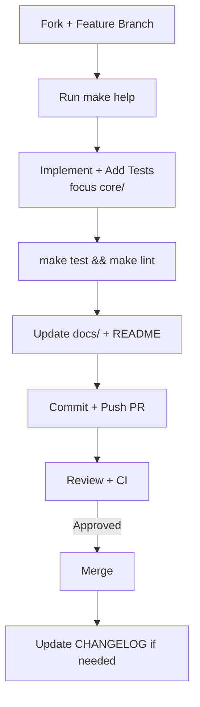

# Contributing

Thank you for your interest in improving HotIron!

## Contribution Workflow

## How to Contribute

1. Fork the repository and create a feature branch.
2. Make your changes.
3. Add unit tests for any new core logic (see [develop.md](develop.md)).
4. Run `make test` and `make lint`. After doc or diagram changes, run `make mermaid` and `make stats`.
5. Update documentation under `docs/` as needed. Do not hand-edit `docs/stats.md`.
6. Submit a pull request.

## Code of Conduct

Be respectful and constructive. This is a tool primarily used by people doing real RF work with limited hardware.

## Development Environment Tips

- Always run `make help` first when you start working.
- The project is intentionally set up so you can do most development on a modern Linux machine (Ubuntu LTS recommended) and still produce Windows binaries.
- Unit tests for the `core/` package are the highest priority for regression protection.
- When touching the native build process, make sure both Linux and Windows artifacts can still be produced.

## Documentation

Please keep `docs/` up to date. The root `README.md` and `AGENTS.md` should reflect major process changes.

## Questions?

Open an issue or start a discussion. We're happy to help new contributors get oriented, especially around the native build or the signal processing core.
