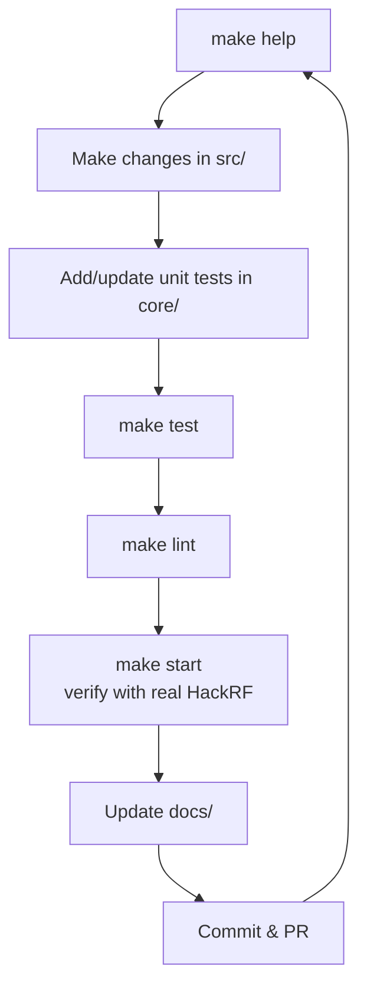
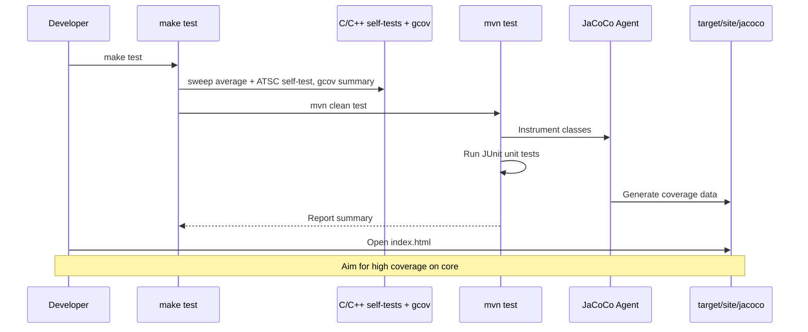

# Development Guide

## Getting the Code

```bash
git clone --recurse-submodules https://github.com/chris-piekarski/hackrf-spectrum-analyzer.git
cd hackrf-spectrum-analyzer
make help
```

## Module layout (`src/hotiron`)

This is a **hybrid JNA desktop module** with C and C++ natives next to Java. Maven owns the Java tree; the Makefile owns native builds and the cross-platform release zip.

| Path | Role |
|---|---|
| `src/main/java`, `src/main/resources` | Maven Java sources and classpath data (`freq-*.csv`) |
| `src/test/java` | JUnit 5 (no radio) + `hw/*IT` behind `-Phardware` |
| `pom.xml` | Java 21, Surefire, JaCoCo, fat JAR (`groupId` `io.github.chris-piekarski`) |
| `Makefile` | Patch `lib/hackrf`, build `.so` / `.dll`, copy launchers, zip |
| `src-c/` | Sweep-as-library patch, native headers, parked-IQ `hackrf_fm.c`, tested sweep-power averaging, and ATSC C/C++ (`atsc/`: GNU Radio shims + libfec) |
| `lib/hackrf` | git submodule (SDK pin) |
| `lib/fftw-3.3.5-dll64`, `lib/libusb-1.0.21` | Vendored headers used by native compilation; Windows also cross-links these trees, while Linux links system libraries |
| `lib/win32-x86-64/libwinpthread-1.dll` | Shipped next to the Windows sweep DLL |
| `lib/launchers`, `src/main/resources/hotiron/` | Start scripts and packaged application icons |
| `build/`, `target/`, `obj/` | Generated — not source |

Do **not** put CSVs under `src/main/java`; classpath data and package icons belong in `src/main/resources`. Do not commit Eclipse `.project` / `.classpath`. Java dependencies come from Maven, not `lib/*.jar`. Do not vendor Ant / JNAerator / 32-bit Windows trees.

## Daily Development Workflow



## Testing

Java unit tests live under `src/hotiron/src/test/java`. Native C/C++ self-tests (no radio) are:

- `src-c/sweep_power_average_selftest.c` — linear-power averaging
- `src-c/atsc/atsc_selftest.cpp` — ATSC shims, PFB RRC, and a synthetic `atsc_rx_process` smoke run (not a full 8VSB modulator)

`make test` builds those binaries with `gcov` (`--coverage`), runs them, writes `src/hotiron/obj/gcov/coverage.txt`, then runs Maven + JaCoCo. `cd src/hotiron && mvn clean test` is Java-only. Counts (files, classes, methods, LOC) are refreshed by `make stats` into [stats.md](stats.md).

```bash
make test
# Java-only shortcut (skips native self-tests and gcov):
cd src/hotiron && mvn clean test
# Native only:
cd src/hotiron && make native-test
```

`make test` must stay green and **never** requires a HackRF. Hardware/integration tests live in `hotiron.hw`, are named `*IT`, and each method is marked `@HardwareTest` (`@Tag("hardware")` + `@Test`). Surefire excludes that tag and `*IT`. Run them only with `make test-hw` (skips if the radio is not enumerated). That profile covers USB presence, firmware/USB API/board via the app’s `.so`, a live sweep through `FFTBins` → `DatasetSpectrumPeak`, start/stop/restart, antenna power + LNA, restart after FFT bin / frequency change, and parked FM IQ followed by sweep resume. See [plans/hardware-integration-tests.md](plans/hardware-integration-tests.md).

`make info` prints the SDK/USB API this tree is pinned to (libhackrf `v2026.01.3`, USB API from the firmware sources, JNA), attached HackRF USB devices, device firmware when the usbfs node is writable, and whether a newer Great Scott Gadgets release exists (GitHub; skip with `HACKRF_INFO_NO_NET=1`).

`make firmware-update` is a **dry-run** of an official GSG SPI-flash. It only writes with `CONFIRM=1`. It is not part of `make build` or `make test`. See [hardware.md](hardware.md).

Coverage:

```bash
make test
# Java: src/hotiron/target/site/jacoco/index.html (JaCoCo, `@{argLine}` in pom.xml)
# Native: src/hotiron/obj/gcov/coverage.txt (gcov on self-test objects; not the release .so)
```

`hackrf_fm.c` and patched `hackrf_sweep.c` are not in the gcov report until they have self-tests; they are exercised by `make test-hw` with a radio.

**Guideline**: New logic in `hotiron/core/` should come with unit tests. Use synthetic `DatasetSpectrum` / `FFTBins` data. Settings belong on `AnalyzerSettings` (test without a JFrame). Overlay policy belongs on `FrequencyAxis` / `BandMark` layers (test without painting). Auto-gain belongs on `AutoGainPolicy` (inject `nowMs`; do not open USB). Auto FFT/samples belongs on `AutoSweepPolicy` (span in, discrete bin + samples out; hysteresis; do not open USB). MCP belongs on `SpectrumSnapshotStore` / `SpectrumMcpTools` (in-process JSON-RPC; no sockets required). Waterfall tick math belongs on `WaterfallTimeScale`. WFM listen belongs on `WfmDemodulator` (synthetic int8 IQ; `AudioSink` fake). Reflection is acceptable for controlling time-based or internal graphics state in `PersistentDisplay` and `DatasetSpectrumPeak`.

### Test → Coverage Workflow




## Linting & Quality

```bash
make lint          # Runs Maven compile
make stats         # Rewrite docs/stats.md from the working tree
make mermaid       # Parse every ```mermaid fence (needs mermaid-cli for full check)
```

There is currently no strict Java formatter or Checkstyle enforced, but please keep code style consistent with surrounding files.

For the native C/C++ parts, a clang-format command is commented in the Makefile.

## Documentation

- All user/developer documentation lives under `docs/`.
- Keep `docs/` in sync with `make help` output.
- The root `README.md` and `AGENTS.md` should be updated when processes change significantly.
- The overview file is root `README.md` only. Do not add a second `Readme.md` (case-sensitive filesystems keep both).

## Architecture Notes

See [architecture.md](architecture.md) for layers, exclusive USB (`RadioMode`), settings/hooks, queues, policy objects, and how engines, overlays, and MCP share data. Read that before adding a second MHz↔pixel map, a `ModelValue` on the JFrame, or a USB open from an MCP snapshot tool.

Key directories:
- `src/hotiron/src/main/java/hotiron/core/` — Engines, DSP, policies, channel plans (best place for unit tests)
- `src/hotiron/src/main/java/hotiron/mvc/` — `ModelValue` + `MVCController` (settings bind; no USB)
- `src/hotiron/src/main/java/hotiron/ui/` — Swing UI; overlay **paint** only (`BandHeaderPainter`)
- `src/hotiron/src/main/java/hotiron/mcp/` — Snapshot store + JSON-RPC (same JVM; no second USB)
- `src/hotiron/src/main/java/hotiron/nativebridge/` — JNA glue
- `src/hotiron/src-c/` — Sweep library patch, parked-IQ receiver, native headers, and ATSC GNU Radio/libfec C/C++
- `src/hotiron/lib/hackrf/` — Submodule (automatically patched during build)

## Working with AI Agents

See the root `AGENTS.md` file. It contains specific instructions for coding agents (always start with `make help`, prefer `docs/`, add tests for core changes, etc.).

Living work plans (larger refactors and hardware follow-up) live under [plans/](plans/README.md). [plans/unit-test-coverage.md](plans/unit-test-coverage.md) is a completed historical plan.

## Syncing with Upstream

This repo is a GitHub fork of [pavsa/hackrf-spectrum-analyzer](https://github.com/pavsa/hackrf-spectrum-analyzer), but the two histories do **not** share commit SHAs (the old commits were rewritten). GitHub's "N commits ahead / M commits behind" banner therefore counts *every* commit on both sides and is not a reliable merge signal.

Do **not** rebase this fork onto `upstream/master` or merge with a default recursive strategy — that would fight the Maven layout, tests, docs, and Quick Select work.

The 2024 upstream release (`v2024.11.10`) is already absorbed: Antenna LNA, min FFT bin size, and the JFreeChart 1.5 renderer API. Host SDK is **v2026.01.3**. The Java UI targets **Java 21** with FlatLaf, JFreeChart 1.5.6, JNA 5.19.1, and MigLayout 11.4.3.

To inspect future upstream changes:

```bash
git remote add upstream https://github.com/pavsa/hackrf-spectrum-analyzer.git   # once
git fetch upstream
git log --oneline master..upstream/master
git diff master upstream/master -- src/hotiron/src/main/java
```

Port individual bugfixes by reading the upstream commit and applying the same change onto this tree. Keep fork-only files (Quick Select, `docs/`, tests, root `Makefile`).

If you have already reviewed and ported everything you want from the current upstream tip, you can record that without taking their tree:

```bash
git merge --allow-unrelated-histories -s ours upstream/master
```

That marks upstream as an ancestor so GitHub shows 0 behind, while leaving this fork's files untouched. Only do this after a file-level review.

## Releasing

Current app version is **2.0.2** (`Version.java`, Maven `pom.xml`, MCP `SERVER_VERSION`).

1. Bump `Version.java`, `src/hotiron/pom.xml`, `SpectrumMcpTools.SERVER_VERSION`, and move `[Unreleased]` in `CHANGELOG.md` to a dated section.
2. Run `make stats` (do not hand-edit `docs/stats.md`).
3. Run full `make build`.
4. Test the resulting zip/launcher on target platforms.
5. Tag `vX.Y.Z`, push `master` + the tag, and `gh release create` with notes and the cross-platform release zip.

## Getting Help

- Run `make help`
- Read the docs under `docs/`
- Check existing issues / discussions on GitHub

Happy hacking!