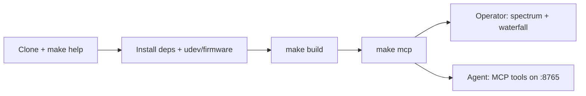

# Getting Started



Turn a HackRF into **HotIron**: live waterfall, QSY to Listen/Watch, **and** MCP so local agents copy the RF bins.

## What you need

### Hardware
- HackRF One (or compatible)
- Firmware **v2024.02.1** or newer (this app matches host SDK **v2026.01.3**)

### Software
- Java 21+ with a desktop (OpenJDK / Temurin — not a headless JRE)
- To build on Linux: Maven, GCC/G++ with C++17, mingw-w64 (for Windows natives), libusb, FFTW, and `zip` — see [building.md](building.md)
- For TV Watch: host `ffmpeg`; audio playback also needs PulseAudio/PipeWire (`libpulse0` on Ubuntu/Debian)

## Fastest path

From the repository root:

```bash
make help          # every target, with descriptions
make info          # confirm the radio, firmware, and SDK pin
make udev          # Linux once: persistent USB permissions
make mcp           # build if needed, launch GUI + MCP on 127.0.0.1:8765
```

The sidebar shows the board name, short serial, and firmware when the radio opens. Hover that line for the full serial and USB API.

## If you already have a zip / installer

1. **Windows**: install the WinUSB driver with Zadig if Windows has not claimed the device. Run the `.cmd` launcher in the package.
2. **Linux**: set udev rules ([hackrf-setup.md](hardware.md)), then run the launcher script.

## First run

- Plug the radio in before you click around. The sweep starts on its own. **Auto gain** and **auto-scale dB** are on by default.
- **Quick Select** jumps to common bands (Wi‑Fi, LTE, FM, amateur 2 m / 70 cm, …). Hover a button for the MHz range. Details: [usage.md](operator.md).
- **Antenna LNA +14 dB** turns on the amplifier on the radio. Use it when the signal is weak; skip it on strong local transmitters.
- Changing the sweep range (Quick Select, the range readout, or plot zoom), gain, or FFT bin retunes automatically.
- Attach an agent with the stdio proxy — **[MCP for AI agents](agents.md)**.

## Next

- [MCP for AI agents](agents.md) — read tools, Listen/Watch controls, diagnostics, client config
- [Usage](operator.md) — buttons, gain, and the status line
- [Radio setup](hardware.md) — firmware, udev, Zadig
- [Development](develop.md) — if you are changing the code
