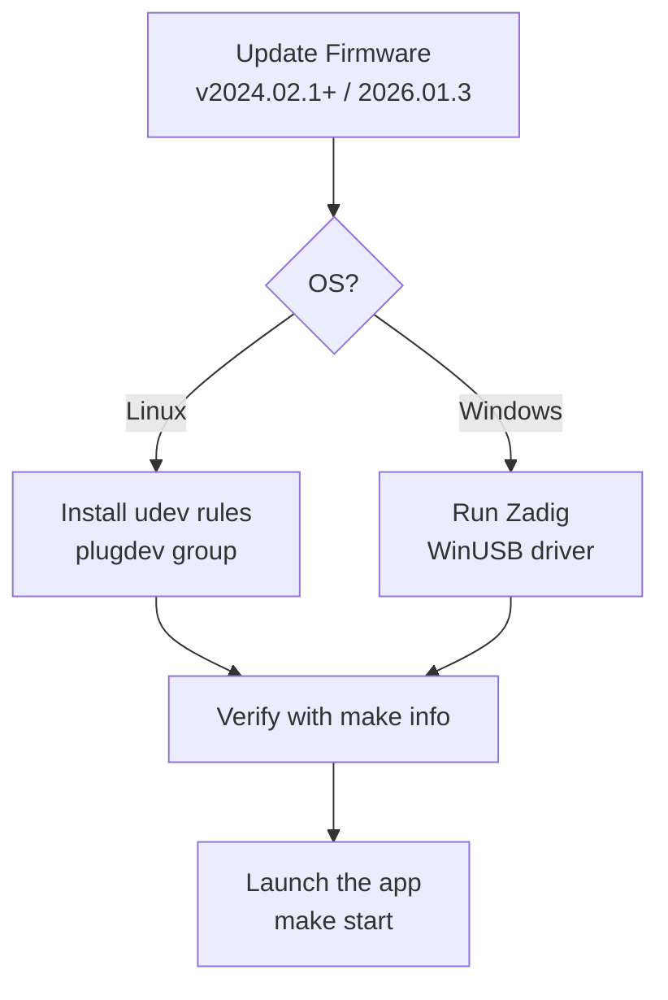

# HackRF Hardware Setup



Proper USB permissions and firmware are critical for reliable operation.

## Firmware

**Minimum**: v2024.02.1. **Matches this app's host SDK**: v2026.01.3 (GSG's current release).

From this repo (HackRF One attached, usbfs writable):

```bash
make firmware-update                         # dry-run: detect board, download image, print sha256
make firmware-update VERSION=2026.01.3 CONFIRM=1   # write SPI flash
```

`CONFIRM=1` is required to write. The target refuses HackRF Pro images on a One, refuses if the usbfs node is not writable, and is **not** run by `make build` or `make test`.

After a write, press RESET (WSL: `usbipd detach` / `attach`) and run `make info`.

Official instructions: https://hackrf.readthedocs.io/en/latest/updating_firmware.html

It is often easiest to perform the update from a Linux virtual machine.

## Linux USB Permissions (udev)

The hackrf library will not be able to open the device by default on most distributions.

Install the rule from this repo (once; needs sudo):

```bash
make udev
```

That copies `scripts/53-hackrf.rules` to `/etc/udev/rules.d/` (`MODE=0666`, `GROUP=plugdev`) and reloads udev. After that, a new attach/replug should come up writable without `chmod`.

Add your user to the `plugdev` group if you are not already:

```bash
sudo usermod -a -G plugdev $USER
```

Log out and back in (or reboot).

Verify with:

```bash
make info          # USB, device firmware, app SDK/USB API pin, and whether a newer GSG release exists
hackrf_info        # official tool (optional; same firmware fields)
```

You should see your device without permission errors. `make info` still lists the USB node if firmware cannot be read (typical WSL `root:root` usbfs).

## WSL2 (Windows host, Linux build)

Windows does not share USB with WSL2 until you attach the device.

**Once (Administrator PowerShell):**

```powershell
usbipd list
usbipd bind --busid <BUSID>          # persist "Shared" across reboots
```

**Once per Windows logon** — run this in Administrator PowerShell; it stays active and re-attaches after a radio reset or unplug:

```powershell
usbipd attach --wsl --auto-attach --hardware-id 1d50:6089
```

`--hardware-id` survives bus-id changes. `--auto-attach` re-attaches after firmware reset or unplug. `bind` only marks the device shared; it does not attach it to WSL.

HotIron hot-loads a newly attached HackRF (WSL `usbipd attach` while the window is open) and starts the sweep. If you pressed **Stop**, it leaves USB alone until **Restart**.

**Once in WSL:**

```bash
make udev    # persistent usbfs MODE=0666; no more chmod after each attach
```

Until `make udev` has been run, usbipd nodes are often `root:root` and need:

```bash
sudo chmod a+rw /dev/bus/usb/00X/00Y
```

HackRF One is `1d50:6089`. In WSL, `lsusb` should then show Great Scott Gadgets HackRF One.

The bench nRF board is a second USB: SEGGER J-Link serial **`000680852409`**, identified as **PCA10031 / nRF51822**. Normal PID is **`1366:1015`** (CDC+MSD+BULK). J-Link Commander can leave it as **`1366:0101`** (J-Link-only, no ACM) — bind that ID and restore VCOM before sniffing. `make udev` covers both PIDs. Sidebar **BLE sniff** / MCP `ble_sniff` opens the ACM; snapshot tools do not. Flash recipe (identify, HEX, `nrfutil device program`): [nrf-sniffer.md](nrf-sniffer.md#flash-recipe).

List the radio and run hardware smoke tests (not part of `make test`):

```bash
make info          # USB + firmware + SDK/API versions vs latest GSG release
make test-hw
```

They skip if no HackRF is enumerated. The sweep IT also needs `libhackrf-sweep.so` from `make build` and a writable usbfs node.

**Listen and Watch** stop sweeping and exclusively park the same HackRF. Listen uses 4 MS/s mono WFM; Watch uses 16 MS/s with an 8 MHz analog filter and requires host `ffmpeg` for MPEG-2/AC-3. Audio uses Java Sound/PulseAudio/PipeWire. On WSL2, playback is silent until Pulse is forwarded to Windows (or you run the JAR on Windows); demodulation and video can still run.

## Windows

- Windows 11 usually works with the default driver.
- On Windows 10 and earlier, use **Zadig**:
  1. Download Zadig (https://zadig.akeo.ie/)
  2. Options → List All Devices
  3. Select "HackRF One"
  4. Choose "WinUSB" driver and install

## Troubleshooting

- "No HackRF boards found" → Check udev / Zadig / cable / firmware.
- Device disappears after parameter change → Power cycle the HackRF (known firmware quirk).
- Permission denied on Linux → Re-check udev rules and group membership.

See also the "Known issues" section in the main README.