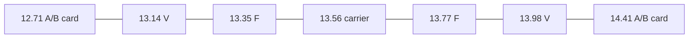
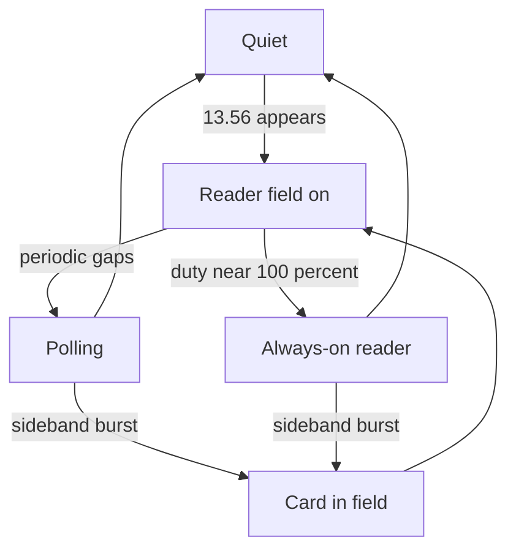

# NFC / HF RFID at 13.56 MHz

Reference for the **NFC** Quick Select and the live sweep classifier. Quick Select is **12–15 MHz** so Type A/B card sidebands are on-screen. `NfcBandPlan` / `NfcActivityTracker` / `NfcBandLayer` label the carrier, sidebands, and harmonics; MCP `nfc_activity` copies that same snapshot. There is no parked-IQ NFC demod and no UID / APDU decode.

NFC is not a channelized band like FM or Wi-Fi. There is **one carrier** at 13.56 MHz. What the operator needs is a **state over time** (quiet, reader field, polling, card talking back) plus **which air interface**, not a station list.

Receive only. This app does not transmit, does not energize tags, and should not grow a Proxmark-style stack. Full A/B/F/V decode already exists in [nfc-laboratory](https://github.com/josevcm/nfc-laboratory).

## What is on the air

HF RFID / NFC is **inductive near-field** (H-field), not a far-field broadcast. Wavelength at 13.56 MHz is about **22 m**, so a card-sized coil is a tiny loop, not a ½-wave dipole.

- A **reader** (PCD) leaves a CW field at 13.56 MHz and modulates it to talk to the card. ISO 14443 field at the card is typically **1.5–7.5 A/m**. Some readers put on the order of **1 W** into the loop.
- A **passive card** (PICC) has no transmitter. It **load-modulates** the reader field. That appears as **sidebands**, often **40–60 dB** below the carrier a short distance away (NIST: ~60 dB beyond ~10 cm).
- A card **alone** is almost invisible. No reader field, nothing to load-modulate.
- Tags often resonate **13.5–15 MHz**, not a razor at 13.56 (Hackaday / NanoVNA notes). A peak a bit high can still be NFC.

dBm is a poor “how far” number here. Treat power as **field present / strong / slamming the 8-bit ADC**.

## Allocations (not exclusive)

| Slot | MHz | What it is |
|---|---|---|
| ITU / ISO ISM | **13.553–13.567** | 14 kHz loud slot. ISO 14443 carrier is 13.56 MHz ±7 kHz. |
| 47 CFR 15.225 | **13.110–14.010** | Stepped mask. Peak 15,848 µV/m @ 30 m only in the 14 kHz ISM hole; skirts are 106 then 334 µV/m. The legal citation is 13–14; the PHY view is **12–15**. |
| HiFER / “22 m” | same 14 kHz ISM | Part 15 ham/experimenter beacons (QRSS, WSPR, ~few mW into a dipole). Roommate of NFC, not NFC. |
| Radio astronomy | 13.36–13.41 | Quiet zone. Reader splash can approach it. |
| Amateur 20 m | 14.000–14.350 | ARRL has worried about 13.56 mask spill into the bottom of 20 m. |
| A/B card LSB | **12.7125** | Maritime mobile (NIST). |
| A/B card USB | **14.4075** | Aviation (NIST). Tag power is tiny; reader modulation splash is the real neighbor issue. |

15.225 stepped mask (µV/m @ 30 m): 13.110–13.410 = 334; 13.410–13.553 = 106; **13.553–13.567 = 15,848**; 13.567–13.710 = 106; 13.710–14.010 = 334.

A persistent skinny CW at 13.56 on a **wide HF** sweep can be a HiFER beacon, an induction heater / other ISM, or an NFC reader. Duty cycle and how local it is separate them: a door reader is fat and local; a HiFER is flea-power and sometimes DX.

Not NFC: **125 kHz** Prox / EM4100 (below HackRF), **433 MHz** container RFID (ARRL’s old 70 cm fight), **902–928 MHz** EPC Gen2 (this app’s **33cm** button).

## Air interfaces

NFC Forum names map to ISO/JIS. Bit rates are negotiated; 106 kb/s Type A is the common phone / tap-to-pay / MIFARE case.

| Name | Spec | Reader (PCD → PICC) | Card (PICC → PCD) | Sidebands |
|---|---|---|---|---|
| **NFC-A** | ISO/IEC 14443-A | **100% ASK**, modified Miller | 106 kb/s: OOK Manchester on **847.5 kHz** (`fc/16`). 212+ kb/s: BPSK, no 847.5 kHz subcarrier | **12.7125 / 14.4075** at 106 kb/s |
| **NFC-B** | ISO/IEC 14443-B | **10% ASK**, NRZ-L | BPSK on 847.5 kHz subcarrier | same **±847.5 kHz** |
| **NFC-F** | FeliCa / JIS X 6319-4 / ISO 18092 | 8–14% ASK, Manchester, 212/424 kb/s | same family, load modulation | near **±212 kHz** (13.35 / 13.77) |
| **NFC-V** | ISO/IEC 15693 / 18000-3 Mode 1 | slow PPM / ASK (1-of-4 or 1-of-256) | ASK or FSK; `fc/32` = **423.75 kHz**, sometimes **484.28 kHz** (`fc/28`) | **13.136 / 13.984** (and ~13.076 / 14.044) |

Vicinity (15693) is the longer-range badge / inventory cousin (tens of cm to a couple of metres). Proximity (14443) is the tap.

Active NFCIP-1 P2P (both sides generate a field) exists and is rare next to payment. Do not assume every 13.56 burst is a phone poll.

**12–15 MHz** is the PHY view: carrier, FeliCa ±212 kHz, 15693 ±424 kHz, and Type A/B card talk-back at 12.71 / 14.41. Keep 13–14 in the citation as 15.225.

Reader harmonics at **27.12 MHz** (2nd) and **40.68 MHz** (3rd) are how many VHF-only SDRs (and a random whip on HackRF) see NFC first. HackRF can take the fundamental; those ticks are still useful.

## Time, not a single sweep row

| State | What it looks like |
|---|---|
| Quiet | No energy at 13.56, or the antenna is a dummy load |
| Always-on reader | CW sits there (door, some POS). Waterfall is a bright vertical line |
| Polling | NFC Forum devices cycle A → B → F → V with the field **off** between tries. Short 13.56 bursts every ~100–500 ms |
| Transaction | Tens of ms of envelope chopping plus a sideband burst, then often idle |
| Card talking | Energy at the sideband offsets while the carrier stays up |

Sweep averaging and hop time work against the short polls. `hackrf_sweep` is a wideband power tool, not a millisecond frame sniffer.

Type A **100% ASK** is carrier *dropouts*. That is modulation, not a disappeared signal. Auto-gain’s “one Wi-Fi packet is not clip” rule needs an NFC cousin if anyone parks IQ here.

## What HotIron does today

Quick Select **NFC** is **12–15 MHz** (`QuickSelectPreset.NFC` / `NfcBandPlan.VIEW_*`). Auto FFT on a 3 MHz span lands near **2.4 kHz** bins — enough to resolve the carrier and the A/B/F/V sideband slots, not enough to classify a 2 ms poll.

Native interleaved hops still pad ±10 MHz (`FrequencyRange.forInterleavedNativeSweep()`), so USB is asked for roughly 2–25 MHz; the dataset/axis stay 12–15.

`NfcActivityTracker` (via `StationDetectSink`) watches filled bins with hysteresis:

| `kind` | Operator / MCP meaning |
|---|---|
| `quiet` | No 13.56 field (or the antenna is too small) |
| `field_on` | Continuous CW at 13.56 or a harmonic |
| `polling` | Regular on/off ~2–10 Hz — phone / reader search, not Morse data |
| `hifer` | Narrow keyed ISM CW (Part 15 / 22 m roommate) |
| `cw` | On/off keying that is not a regular poll |
| `nfc-ab` / `nfc-f` / `nfc-v` | Sideband energy at the catalog offsets — a card is load-modulating |
| `hidden` | Zoomed out past the NFC / harmonic windows |

A Morse-like blink on the waterfall is usually **HiFER** or **polling**. It is not an NFC payload and it is not an AirTag (those beacon on Bluetooth 2.4 GHz / UWB). Occupancy can label a 13.56 peak `13.56` / `NFC-A/B` the way Wi-Fi gets `ch 6`.

**Scan** (click a 13.56 / ×2 / ×3 header tick) dwells 12–15, then **26–28** (27.12), then **40–42** (40.68). Click a header tick again to stop.

MCP `nfc_activity` is that same snapshot (`kind`, duty, `pollHz`, sideband flags, `trackingHint`). Read-only, no extra USB path. For the time-frequency stack (poll / HiFER blinks), use `spectrum_history_bins` on a 12–15 MHz window — that is the snapshot ring, not the waterfall image.

Parked IQ at 11.56 MHz / 10 MS/s is still the better instrument for frame-level classification. That is not in this pass. FM Listen’s 4 MS/s path *covers* ±847.5 kHz if the LO is offset so 13.56 is not on DC; it is thin compared with what people use to *decode*.

## Practical HackRF (from SDR / ham writeups)

[nfc-laboratory](https://github.com/josevcm/nfc-laboratory) is the recipe people follow. For HackRF they do **not** park on 13.56:

| Parameter | Working default |
|---|---|
| LO | **11.56 MHz** |
| Sample rate | **10 MS/s** |
| Carrier IF | **+2 MHz** (off the zero-IF DC spike) |

AirSpy / RTL users who cannot tune 13.56 use **27.12** or **40.68**. 8-bit / low-rate setups only get clean **106 kb/s** Type A on a good antenna.

**Antenna is the hard part.** A Wi-Fi whip is a dummy load at 22 m wavelength. Use a **small loop** (a few turns, ~8–12 cm) or salvage a commercial reader loop (**RC522** boards are the usual junk-box match: remove the chip, take the tuned loop + matching network). Jenny List’s Hackaday piece: couple with a 1-turn pickup and a NanoVNA / dip meter; look for an SWR dip near 13.5–15 MHz.

**Front end.** A 60 mm pickup next to a strong reader can see **~4 V RMS per turn** (ham.SE). Pad, series C, or loose coupling. Do not slam a resonant loop into the SMA.

**Half-duplex.** HackRF cannot be a proper reader: dropping TX to RX kills the field and the card. PortaPack/Mayhem consensus: sniff only. That matches this app.

Professional SA procedure (Keysight / R&S): **do not stare at 13.56 to see the card**. Measure **12.71 / 14.41**, often with a carrier notch or bridge; **gated FFT or zero-span on the sideband** during the load-mod burst.

## What the HUD says

The plot overlay is catalog ticks (`13.56`, `A/B`, `F`, `V`, `×2`, `×3`) plus a one-line `NfcHud` from `NfcActivity.summary()`. Typical lines:

- `NFC quiet — no 13.56 field (or the antenna is too small). Not an AirTag band.`
- `Reader field on at 13.560 MHz (… dBm). Continuous CW.`
- `13.56 MHz polling ~2.5 Hz … Phone or reader search, not Morse data.`
- `Narrow 13.56 ISM CW (HiFER / Part 15 beacon). … Not NFC-A and not an AirTag.`
- `Type A/B load-mod sidebands at 12.71 / 14.41 MHz — a card is talking on an NFC reader field.`

Sweep scores **sideband bins**, not energy at 13.56, for card talk-back — the carrier hides it.

## What not to build

- ISO 14443 / EMV / MIFARE decode, UID dumps, APDU payloads. Different product; dual-use.
- Time-slicing sweep and NFC IQ. One radio.
- Treating 125 kHz or UHF RFID as this button.
- Assuming every 13.56 spike is a reader (HiFER / heaters).
- Putting the LO on 13.56 in parked IQ (carrier becomes the DC spike).

## Later (not this pass)

Parked IQ classifier at 11.56 MHz / 10 MS/s: reuse `hackrf_fm` / `IqSpectrum`; envelope vs time (not audio); tests on synthetic int8 IQ. Hardware IT: park then resume sweep. Do not put the LO on 13.56.

## Sources

- ISO/IEC 14443-2 / 15693, NFC Forum A/B/F/V, 47 CFR 15.225, ITU ISM 13.553–13.567.
- NIST: Novotny, Guerrieri, Francis, Remley — *HF RFID Electromagnetic Emissions and Performance* (carrier on for the whole transaction; tag ~60 dB down; LSB maritime, USB aviation; radio astronomy 13.36–13.41).
- Keysight 5992-2067 — NFC-A/B sidebands at 12.71 / 14.41; gated FFT on the load-mod burst.
- Rohde & Schwarz 1MA113 — ISO 14443 Type A 100% Miller vs Type B 10% NRZ; measure sidebands, not the carrier, for the card.
- [josevcm/nfc-laboratory](https://github.com/josevcm/nfc-laboratory) — HackRF **11.56 MHz / 10 MS/s**; RC522 loop; harmonics 27.12 / 40.68 for radios that cannot tune 13.56.
- [ham.SE 15311](https://ham.stackexchange.com/questions/15311/demodulating-iso14443-part-of-nfc-using-sdr) — pickup voltage, sidebands ~40 dB down, nfc-lab pointer.
- Jenny List, [Hackaday — NFC Performance: It’s All In The Antenna](https://hackaday.com/2021/11/10/nfc-performance-its-all-in-the-antenna/) — magnetic loops, tags often 13.5–15 MHz.
- HiFER / 22 m: W1TAG *Antenna Selection… 22 Meter “Hifer” Band*; VA3ROM RM046/RM048; [HFUnderground HiFER](https://hfunderground.com/wiki/index.php/HiFER). ARRL Letter 2001-10-19 (13.56 mask vs bottom of 20 m). ARRL RFID advocacy is mostly **433 MHz**, not this band.
- PortaPack Mayhem #1389 — HackRF half-duplex cannot keep a card powered.

See also [operator.md](operator.md) (NFC Quick Select), [architecture.md](architecture.md) (`FrequencyAxis` / `BandMark`, exclusive USB), [plans/fm-radio-tuner.md](plans/fm-radio-tuner.md) (parked-IQ pattern).
