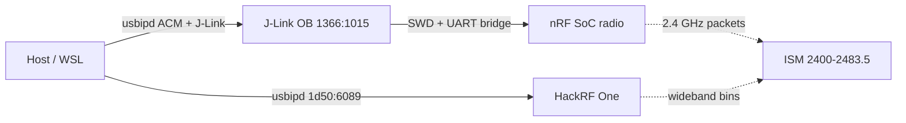

# nRF 2.4 GHz sniffer (bench J-Link)

Reference for the **SEGGER J-Link / Nordic nRF5x DK** on this bench, the 2.4 GHz protocols that chip family can run, and which of those have an official **packet sniffer**. Spectrum energy is still the HackRF. Packets come from this second USB device. Implementation plan: [plans/nrf-sniffer.md](plans/nrf-sniffer.md).

Quick Select **BLE** is **2400–2484 MHz** (`BleBandPlan` / `BleBandLayer`) so advertising 37/38/39 are on-screen. Sidebar **BLE sniff** / MCP `ble_sniff` opens the J-Link CDC and consumes Nordic UART/SLIP v3 (`BleSniffEngine`). That does **not** park the HackRF. Do not open `/dev/ttyACM0` from a snapshot tool (`ble_frames` / `ble_activity` only read the ring). Packet decode needs the matching sniffer HEX on the nRF — flash is operator work, not `make build`. Recipe below.

## What is plugged in

USB shows a debugger, not a “BLE radio” product name.

| Field | This bench (2026-08-23) |
|---|---|
| Windows `usbipd` | bus **7-2**, Shared then Attached (bus can move) |
| VID:PID | **`1366:1015`** SEGGER J-Link (CDC+MSD+BULK). May drop to **`1366:0101`** (J-Link-only) if Commander disables VCOM. |
| USB serial | **`000680852409`** |
| WSL `lsusb` | `ID 1366:1015 SEGGER J-Link` |
| CDC ACM | **`/dev/ttyACM0`** → `usb-SEGGER_J-Link_000680852409-if00` |
| Mass storage | Windows `G:` / Linux `/dev/sd*` label **JLINK** (~10.7 MB); old 4-file SAM3U MSD |
| Other interfaces | CDC Data + vendor BULK (J-Link) |

That is the **on-board J-Link OB** (Atmel SAM3U, firmware `J-Link OB-SAM3U128-V2-NordicSemi` compiled Jul 12 2018). It programs the **nRF SoC** on the same PCB and bridges that SoC’s UART to ACM. The nRF52840 **USB dongle** (PCA10059) is a different gadget (`1915:…` Nordic DFU/USB); it is **not** this VID:PID.

**Identified 2026-08-24** with `nrfutil device device-info` (J-Link DLL + writable usbfs): **PCA10031 / nRF51822** (`NRF51_FAMILY`, `NRF51xxx_xxAC_REV3`). Official nRF Sniffer **4.1.1** HEX files are nRF52-only and must **not** be written to this chip. Last Nordic image for this board is the v2.x `sniffer_pca10031_*.hex` (nRF51 Dongle). Current HotIron host speaks UART/SLIP v3; nRF51 firmware is the older v2 generation.

`make udev` also covers `1366:1015` and `1366:0101` so the J-Link usbfs node is `0666` like the HackRF.



## Chip capability vs official sniff firmware

The SoC can **run** more stacks than Nordic ships a **sniffer** for. One firmware image at a time. Flashing BLE sniffer **replaces** 15.4 sniffer (and any ANT app).

| On air | nRF52832 (PCA10040) | nRF52840 (PCA10056) | Official Nordic sniffer? |
|---|---|---|---|
| Bluetooth LE (1M / 2M / coded on 840) | yes | yes | **Yes** — [nRF Sniffer for Bluetooth LE](https://www.nordicsemi.com/Products/Development-tools/nRF-Sniffer-for-Bluetooth-LE) |
| Bluetooth Mesh | adv on BLE | adv on BLE | Same BLE sniffer (advertising PDUs) |
| ANT / ANT+ | yes (S212 / S332) | yes (ANT for nRF) | **No** official sniffer image |
| IEEE 802.15.4 (Thread, Zigbee, Matter) | no | yes | **Yes** — [nRF Sniffer for 802.15.4](https://www.nordicsemi.com/Products/Development-tools/nRF-Sniffer-for-802154) (52840 / 5340 only) |
| 2.4 GHz proprietary (ESB, Gazell) | yes | yes | No official sniffer |
| NFC-A tag (13.56, OOB pairing) | listen as tag | listen as tag | Not a sniffer. HotIron NFC is the HackRF: [nfc.md](nfc.md) |

Host capture path for the official sniffers is **Wireshark extcap** + a UART/SLIP protocol on the CDC port (`nrfutil ble-sniffer` / `nrf802154_sniffer`). Packet metadata includes channel, RSSI, timestamp — not a spectrum sweep.

## Spectrum (HackRF) vs packets (nRF)

| Job | Radio | Window |
|---|---|---|
| Energy, occupancy, waterfall | HackRF sweep | **2400–2484 MHz** to cover BLE 39 and 15.4 ch 26 |
| BLE / 15.4 **frames** | nRF + matching sniffer HEX | One PHY image; ACM protocol |
| ANT energy | HackRF (often **2457 MHz**) | Skinny 1 MHz line, not a decode |

Quick Select **WiFi 2** is **2402–2472**. That covers BLE adv **37** and **38** and data 0–36. It **cuts off BLE 39 (2480)** and 802.15.4 ch **26 (2480)**. Do not treat WiFi 2 as “all BLE.”

Overlays still go through `FrequencyAxis` + `BandMark`. Do not invent a second MHz↔pixel map. A BLE / 15.4 / ANT layer should look like `NfcBandLayer` / `WifiChannelPlan`.

## Channel plans (2.4 GHz ISM)

Worldwide unlicensed **2400–2483.5 MHz**. Same band as Wi-Fi. Not a separate allocation.

### Bluetooth LE

40 channels, 2 MHz spacing, GFSK. 1M PHY ~1 MHz occupied; 2M PHY ~2 MHz.

| BLE ch | MHz | Role |
|---|---|---|
| **37** | **2402** | advertising |
| **0–36** | **2404 … 2478** | connected hop |
| **38** | **2426** | advertising |
| **39** | **2480** | advertising |

Idle phones light the **three** adv ticks. A connection sprinkles the 37 data channels (looks like hash next to Wi-Fi). AirTags / Tile / Find My beacons are this band (precision find is UWB ~6–8 GHz).

Nordic’s BLE sniffer lists advertisers (address, name, RSSI), can follow one connection, and can decrypt **when the operator already has the keys** (LTK / IRK / OOB) for a device they are debugging. That is own-product debug, not a cracking tool. Do not add key recovery or MITM.

### IEEE 802.15.4 (Thread / Zigbee / Matter)

16 channels on page 0, **5 MHz** spacing, ~2 MHz O-QPSK. Center \(f = 2405 + 5 \times (N - 11)\) MHz.

| 15.4 ch | MHz |
|---|---|
| 11 | 2405 |
| 12 | 2410 |
| … | +5 |
| 25 | 2475 |
| 26 | 2480 |

Official 15.4 sniffer HEX names (examples): `nrf802154_sniffer_nrf52840dk.hex`, `nrf802154_sniffer_nrf52840dongle.hex`. Not for PCA10040.

### ANT / ANT+

ANT RF is 1 MHz channels: host “frequency” \(N\) is **2400 + N MHz** (typically \(N = 3…80\) → 2403–2480). ANT+ **profiles** (HRM, cadence, …) are assigned a frequency; HRM is **2457 MHz** (`0x39`). There is **no** Nordic “nRF Sniffer for ANT.” A Garmin ANT+ USB stick (`0fcf:…`) is a different device and is **not** on this bus.

## Flash recipe

Operator work. Not `make build` / `make firmware-update` (those are HackRF). Wrong HEX can brick the SoC. Identify the PCA, then write **only** the matching image. One firmware at a time.

### 1. Identify

Attach the J-Link to WSL ([hardware.md](hardware.md)), then:

```bash
make udev   # once; covers 1366:1015 and 1366:0101
nrfutil install device
nrfutil device device-info --serial-number 000680852409 --jlink-dll "$JLINK_DLL"
```

`$JLINK_DLL` is `libjlinkarm.so` from a SEGGER J-Link pack (official installer under `/opt/SEGGER/JLink`, or the Linux tarball). Without it, `nrfutil` guesses the PCA and must not be trusted.

This bench (2026-08-24): **PCA10031 / nRF51822** (`NRF51_FAMILY`, `NRF51xxx_xxAC_REV3`). Stop HotIron **BLE sniff** first so the ACM is not holding the port.

### 2. Pick the HEX

| `device-info` | File | Where |
|---|---|---|
| **PCA10031 / nRF51822 (this bench)** | `sniffer_pca10031_*.hex` | Archived Nordic nRF Sniffer **2.x / 3.x** zip (3.1.0 was the last common package with nRF51). Current 4.1.1 does **not** ship this. |
| PCA10040 / nRF52832 | `sniffer_nrf52dk_nrf52832_*.hex` | `nrfutil install ble-sniffer` → `~/.nrfutil/share/nrfutil-ble-sniffer/firmware/` |
| PCA10056 / nRF52840 DK | `sniffer_nrf52840dk_nrf52840_*.hex` | same |
| PCA10059 dongle | `sniffer_nrf52840dongle_nrf52840_*.zip` | DFU on the **nRF USB** port, not this J-Link ID |

Do **not** write any `sniffer_nrf52*` file to this PCA10031. Do **not** drag an nRF52 HEX onto the JLINK MSD volume.

If the nRF51 image is already on this machine from an earlier attempt, it is `~/.nrfutil/share/nrfutil-ble-sniffer/firmware/sniffer_pca10031_1c2a221.hex`. Confirm Intel HEX (`:` records, EOF `:00000001FF`) before programming.

### 3. Program (this bench)

```bash
# usbipd on Windows (bus id moves; --hardware-id survives that)
usbipd list
usbipd attach --wsl --hardware-id 1366:1015

export PATH="$HOME/.local/bin:$PATH"
export JLINK_SN=000680852409
export JLINK_DLL=/opt/SEGGER/JLink/libjlinkarm.so   # or the extracted tarball .so
export HEX="$HOME/.nrfutil/share/nrfutil-ble-sniffer/firmware/sniffer_pca10031_1c2a221.hex"

nrfutil device program \
  --firmware "$HEX" \
  --serial-number "$JLINK_SN" \
  --family nrf51 \
  --jlink-dll "$JLINK_DLL" \
  --options chip_erase_mode=ERASE_ALL,verify=VERIFY_READ,reset=RESET_SYSTEM
```

Fallback if `nrfjprog` is installed instead:

```bash
nrfjprog -f nrf51 --program "$HEX" --chiperase --verify --reset
```

nRF52 boards: drop `--family nrf51`, use the 4.1.1 HEX from the table, and `-f nrf52` for `nrfjprog`.

### 4. Restore VCOM if the probe becomes `1366:0101`

J-Link Commander / a SWD connect can leave the OB as J-Link-only (no CDC). Sniff needs ACM.

```text
JLinkExe
# then:
vcom enable
```

Power-cycle the DK. It should come back as `1366:1015`. If Windows shows the new PID as **Not shared**, elevated:

```text
usbipd bind --busid <id>
usbipd attach --wsl --busid <id>
```

Unplug/replug often restores `1015` without Commander.

### 5. Check

```bash
lsusb -d 1366:1015
ls -l /dev/ttyACM0 /dev/serial/by-id/*J-Link*
```

Then sidebar **BLE sniff** or MCP `ble_sniff`. HackRF stays in `radioMode: sweep` on 2400–2484. `ble_frames` listing ADV_IND means the image is talking.

This nRF51 HEX is Nordic UART **v2**. HotIron’s host is **v3**, so the ACM can be open and the ring still empty until that decoder is adjusted. Spectrum overlay does not need the flash.

Newer nRF52 DKs: use the **nRF USB** port with current `nrfutil ble-sniffer` (Academy note), not only the interface-MCU USB. Host capture remains UART/SLIP v3 (or `nrfutil`/extcap as a child) — do not rewrite BLE in Java.

## WSL / permissions

Same usbipd pattern as the HackRF ([hardware.md](hardware.md)):

```powershell
usbipd list
usbipd bind --busid <id>    # Administrator if the PID just changed (1015 ↔ 0101)
usbipd attach --wsl --hardware-id 1366:1015
```

`--hardware-id` survives bus-id changes. After attach, `lsusb` shows both `1d50:6089` and `1366:1015`. If the OB is J-Link-only, bind `1366:0101` and restore VCOM (step 4 above).

`ttyACM0` is `root:dialout` here (user is in `dialout`). JLINK MSD is `root:disk`. ModemManager on some hosts sends AT to ACM and corrupts the UART; Zephyr’s Nordic J-Link note is a udev ignore for `ATTRS{idVendor}=="1366"`.

Do not run Zadig WinUSB on the J-Link if you still need it on Windows — usbipd bind is enough for WSL.

## What not to build

- Opening this USB from `spectrum_summary` / other snapshot tools.
- A second HackRF-style sweep on the nRF (it is a narrowband packet radio).
- Emulate / advertise / inject / MITM / pairing attacks / key recovery.
- A second 2.4 GHz MHz↔pixel map.
- Treating Wireshark as something to vendor into `lib/`.
- Promising ANT or ESB **decode** until a real capture path exists.
- Using the DK’s NFC antenna as an NFC sniffer (it is a tag).

## Sources

- [nRF Sniffer for Bluetooth LE](https://www.nordicsemi.com/Products/Development-tools/nRF-Sniffer-for-Bluetooth-LE) and [nrfutil ble-sniffer overview](https://docs.nordicsemi.com/bundle/nrfutil/page/nrfutil-ble-sniffer/guides/overview.html)
- [Setting up nRF Sniffer (Developer Academy)](https://academy.nordicsemi.com/courses/bluetooth-low-energy-fundamentals/lessons/lesson-6-bluetooth-le-sniffer/topic/nrf-sniffer-for-bluetooth-le/)
- [nRF Sniffer for 802.15.4](https://www.nordicsemi.com/Products/Development-tools/nRF-Sniffer-for-802154) / [github.com/NordicSemiconductor/nRF-Sniffer-for-802.15.4](https://github.com/NordicSemiconductor/nRF-Sniffer-for-802.15.4)
- [Nordic nRF5x Segger J-Link (NCS / Zephyr)](https://docs.nordicsemi.com/bundle/ncs-3.2.1/page/zephyr/develop/flash_debug/nordic_segger.html)
- [nrfutil device program](https://docs.nordicsemi.com/bundle/nrfutil/page/nrfutil-device/guides/programming.html) / [Using J-Link VCOM](https://kb.segger.com/Using_J-Link_VCOM_functionality) (`vcom enable`, then power-cycle)
- [nRF52840 DK tools](https://www.nordicsemi.com/Products/Development-hardware/nRF52840-DK/Development-Tools) (BLE, mesh, Thread, Zigbee, 802.15.4, ANT, 2.4 proprietary)
- [S332 SoftDevice](https://www.nordicsemi.com/Products/Development-software/S332-ANT) (concurrent BLE + ANT on nRF52832)
- IEEE 802.15.4-2020 cl. 10.1.3.3 — 2.4 GHz channels 11–26
- ANT+ HRM RF: 2457 MHz (Nordic `HRM_ANTPLUS_RF_FREQ`)
