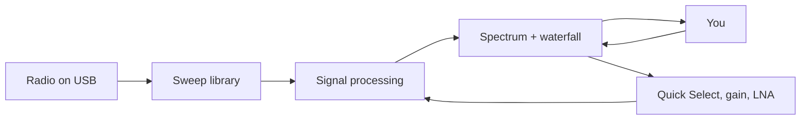

# Operator UI

## Start

```bash
make start
```

That builds if needed and opens the window. You can also run the packaged launcher after a build:

```bash
./src/hotiron/build/hotiron/hotiron.sh
```

Windows ships `hotiron.cmd` next to it. The window title is **HotIron**. At startup, the window fills the current monitor (minus a margin) so the settings panel is visible without scrolling. On a shorter display, the settings column remains scrollable.

## MCP (agents)

This app is built so a **local AI agent** can read the live sweep. Product pitch, tool table, and client config: **[agents.md](agents.md)**.

The running process exposes an MCP server so an agent can pull the same sweep the plot is showing, and park **Listen** / **Watch**. It does **not** open a second radio. Operator flags:

```bash
make mcp                 # GUI + listen on 127.0.0.1:8765
# or
./src/hotiron/build/hotiron/hotiron.sh --mcp
# optional: --mcp-port=8765   --mcp-stdio
```

Point a local MCP client at the stdio proxy (the GUI must already be listening):

```json
{
  "mcpServers": {
    "hotiron": {
      "command": "python3",
      "args": ["scripts/mcp-hotiron-proxy.py"],
      "env": { "HOTIRON_MCP_PORT": "8765" }
    }
  }
}
```

Tools: `spectrum_summary`, `spectrum_snapshot` (optional `maxPoints`, `minDbm`), `radio_identity`, `sweep_config` (radio vs display, including `radioMode`, `listenMHz`, `tvChannel`, `tvLocked`), `fm_stations`, `nfc_activity`, `nfc_frames`, `fm_spectrum`, `spectrum_occupancy`, `spectrum_history`, `spectrum_history_bins` (ring frames with `points`, not the waterfall PNG), `tv_debug` (includes an `ffmpeg` object when Watch is parked), `tv_debug_history`, plus writes `fm_listen` (`mhz`), `tv_watch` (`channel`), and `nfc_sniff`. Unfilled hop holes are omitted, not reported as −150 dBm. Snapshots are sampled at most 10 times per second. The GUI must already hold the radio; MCP does not open a second USB device.

The sidebar **MCP** line (and the status-bar `MCP` field) show whether this process is listening (`127.0.0.1:8765`), how many clients are connected, their `initialize` names, and the last tool they called. **MCP off** means the GUI was started without `--mcp` — use `make mcp`. **MCP failed** means the port is already taken.

## What you are looking at



- **Spectrum** — power vs frequency for the current sweep. During **FM Listen**, this chart switches to the live 4 MS/s parked-IQ spectrum (about ±2 MHz around the tuner LO, with the station at +100 kHz). During **TV Watch**, it switches to the live 16 MS/s parked-IQ spectrum (±8 MHz around the channel center). During **NFC Sniff**, it stays on **12–15 MHz** from the parked 10 MS/s IQ (LO 11.56 MHz). Peak hold, persistence, and the MCP `spectrum_history` ring keep running on that local FFT (same half-life controls as sweep). It returns to the operator sweep range afterward. **Auto gain** (default) sets LNA then VGA so the live peak sits near −28 dBm for this Quick Select. The **dB axis auto-scales** the live band (10 dB pad, 10 dB ticks). Turn **Auto-scale dB axis** off under Chart options for a fixed **−100…+20** window. When auto-scale is on, the **waterfall palette** uses the same window so FM/Wi-Fi peaks are not crushed into the blue end of a fixed −90…−25 scale. Auto-scale holds through wobble and bursty peaks, opens a tick only if a signal would clip, and shrinks at most one 10 dB tick every few seconds if that whole stretch stayed quiet. **Drag horizontally** on the plot to zoom that frequency span (the radio retunes; the sweep-range readout follows). **Double-click** or **scroll down** to zoom out one step; **scroll up** zooms in around the cursor. The axis updates immediately; the radio waits ~120 ms after the last zoom/Quick Select so a wheel flick is one retune, and the last sweep stays on screen until the new window’s first full sweep arrives. Quick Select clears the zoom stack. When the view is **wider than a single Quick Select button**, those presets are drawn as labeled vertical bands (FM, WiFi 2, LTE-1, 2m, …). Names sit in the **top header**, same as Wi-Fi / FM channel labels. ITU survey envelopes (HF/VHF/UHF) are lighter. A band that fills the plot is omitted so it does not cover the whole screen. Wi-Fi overlay marks the **occupied 20 MHz** of each US channel (ch N starts at center−10 MHz). On 2.4 GHz those slices overlap every 5 MHz (ch 1 is 2402–2422, ch 2 is 2407–2427, ch 11 is 2452–2472). On 5 GHz the 20 MHz channels do not overlap. The empty stretch after channel 64 is U-NII-2B (5350–5470, weather radar) plus unused 5330–5490, not a wide channel. 1 / 6 / 11 and 36 / 48 / 149 / 165 are brighter. The radio’s 20 MHz interleaved hop is padded ±10 MHz under the requested window so FM 88–108 is actually filled (otherwise 97.3 sits in a 93–98 MHz hole). On **FM**, only stations seen in the live sweep are marked — and only when the view is zoomed to that band (about 30 MHz or less), so a wide survey does not fill the header with unreadable 97.3 tags. Each peak is snapped to the US 200 kHz dial (47 CFR 73.201) and labeled like **97.3**. Confidence rises over a few tenths of a second of repeated hits and decays over about two seconds after the peak drops, so a one-sweep flash is not labeled. Empty channels stay unlabeled. Use a finer FFT bin (100 kHz or less) so adjacent odd-tenths separate.
- **Waterfall** — the same RF range over time (newest at the top), labeled **RF waterfall** on the panel and in the status bar. A **time scale** on the left marks **now**, then 1s / 2s / 5s / … down the history. Hover a row for MHz and age. In **Listen** the panel switches to **AUDIO · 0–16 kHz** (gold badge; peak in dBFS). In **Watch** the **same strip** becomes **VIDEO · ±8 MHz** (16 MS/s IQ through an 8 MHz analog filter, with 6 MHz ATSC in the middle). In **NFC Sniff** it is **NFC · 12–15 MHz** (same RF raster as Watch, newest at the top — 13.56 vs 12.71 / 12.96 stay visible over seconds). The **13.56 |IQ|** scope is the small LCD in the NFC sniff sidebar: carrier mixed to baseband, last 500 ms, dashed decode floor at −40 dBFS. Field on is a flat line; Type A polls are notches. Wideband HF hash is rejected. The split stays where it was — Watch does not steal height from the spectrum. Decoded MPEG-2 video appears in the 16:9 TV-tuner preview; the waterfall remains the VIDEO IQ raster. Pause freezes both the raster and the ages. History is kept when only LNA/VGA change; a Quick Select or zoom that moves the MHz window still clears it.
- **Status bar** — resolution, FFT bin count, waterfall rate, peak power, MCP bind/clients
- **Sidebar** — Quick Select bands, one **sweep range** readout (type `88-108`, pan ◀▶, zoom −/+), radio identity, **MCP** (bind and connected agents), FM tuner, TV tuner, **NFC sniff**, Pause, then gain and display options

The sweep retunes whenever you change a setting.

## Radio identity and Pause

The line above **Pause** is the attached unit, not a boolean “connected” flag:

| Line | Meaning |
|---|---|
| Board name | HackRF One, HackRF Pro, … |
| `SN ……` | Last 8 hex digits of the MCU / USB serial |
| `FW …` | Firmware version |

Hover it for the full serial, USB API, and whether a sweep is running.

The **MCP** block under the radio identity is this process’s agent endpoint, not USB:

| Line | Meaning |
|---|---|
| `MCP  127.0.0.1:8765` | Listening (TCP). `stdio` if `--mcp-stdio`. |
| `idle · no clients` | Bound, nothing connected yet. Point the stdio proxy at this port. |
| `claude-code` / `2 clients` | Connected MCP client(s), named from `initialize.clientInfo`. |
| `last spectrum_summary` | Most recent tool call. |
| `MCP  off` | Started without `--mcp`. |
| `MCP  failed` | Bind error (port in use). |

**Pause** freezes the plot. The active RF path continues running—sweep, Listen, or Watch; **Resume** shows live data again. It does not reset USB.

| Control | What it does |
|---|---|
| **Restart** | Stop and start the active RF path. Use this if the plot dies after a setting change (firmware quirk) instead of pressing RESET on the board. Leaves Listen or Watch mode and resumes sweeping. |
| **Stop** | Halt the native sweep, Listen, or Watch path and release USB so `make info`, another instance, or GNU Radio can open the stick. **Restart** takes it back. |
| **FM tuner** | Analog-style face: big **97.3** readout. **− / +** (Tune) is one 200 kHz channel. **Scan** leaves Listen, sweeps **88–108 MHz** for a couple of seconds, and pins those stations as the Seek list (button reads **Scanning…**). **◀◀ / ▶▶** (Seek) and the **knob** jump the next scanned station (or one raster step if the list is empty). **Listen** QSYs the HackRF onto parked IQ (HUD: **Listening 97.3 FM — parked IQ**). Gold cursor on the plot; the waterfall becomes a live **audio** spectrum (0–16 kHz). Click a **97.3** header tag to jump to it. Click **Listening 97.3** again to resume the RF sweep. |
| **TV tuner** | US ATSC 1.0 channels **2–36** (6 MHz, 47 CFR 73.603). **− / +** Tune skips the FM/aviation gaps. **Scan** leaves Watch, sweeps **V-TV** then **U-TV** (~2.5 s of live sweeps each, after USB is up), and pins occupied 6 MHz bricks as the Seek list. The waterfall clears when the window hops so VHF history is not remapped onto UHF. Auto-gain waits until Scan finishes so it does not restart USB mid-survey. **Seek** jumps that list (kept across a later Wi‑Fi sweep) plus live parked-IQ hits in the ±8 MHz window. **Watch** parks the HackRF at 16 MS/s with an 8 MHz analog bandwidth. HUD is **WATCH ch N — parked IQ · …**. The waterfall stays the **VIDEO · ±8 MHz** IQ strip (same size as Listen). **Decoded video** is the 16:9 box **under Watching ch N** in this tuner — IQ spectrogram until MPEG-2 locks, then the picture. AC-3 on the speakers. Click a **14** header tag to jump to it. Click **Watching ch 14** again to resume the RF sweep. With Auto gain enabled, UHF Watch starts at LNA 40 dB + VGA 22 dB, turns on the HackRF RF amp (+14 dB) for that parked session only, and keeps trimming IF toward ~0.5 RMS without restarting USB; uncheck Auto to use the sliders and the Antenna LNA checkbox. HackRF is 8-bit — indoor VHF (ch 2–6) is often too weak; a strong UHF 14–36 brick is the usual bet. |
| **Radio picker** | Serial of the HackRF to open. *First radio* is libhackrf’s default. |
| **CLKOUT 10 MHz** | Drive the CLKOUT pin so another radio can lock. CLKIN is selected automatically when a 10 MHz signal is present. |

Gain, LNA, and bias-tee stay in the **HackRF Settings** tab.

## Quick Select

Integer-MHz survey windows. The app starts on **WiFi 2** (highlighted) so the first sweep is 2402–2472 MHz. Hover a button to see the MHz range on the reserved line under the grid. Other controls show a hint over the settings column without changing its size or opening another window. Clicking a band while **Listen** or **Watch** is parked stops the audio/video and resumes the sweep on that range. Citations are in this table. They are envelopes, not exclusive licenses.

| Button | MHz | What it is |
|---|---|---|
| All | 1–7250 | Full selectable survey range. Auto FFT keeps this coarse (~2 MHz bins) so the waterfall stays fast. |
| WiFi 2 | 2402–2472 | Occupied US 802.11 ch 1–11 (ch 1 starts at 2402, ch 2 at 2407, ch 11 ends at 2472). The 20 MHz channels overlap. |
| WiFi 5 | 5170–5895 | Occupied US 802.11 20 MHz ch 36–177 (ch 36 starts at 5170, ch 177 ends at 5895). U-NII-1 legally starts at 5150; there is no 20 MHz channel there. The hole after 64 is not Wi-Fi. |
| LTE-1 | 1695–2200 | 3GPP AWS + PCS + IMT (B70/B66/B4/B3/B2/B25/B1/B65). |
| LTE-2 | 617–960 | 3GPP 600/700/800/850/900 (B71 DL through B8 DL). |
| NFC | 12–15 | 13.56 MHz HF RFID PHY (47 CFR 15.225 citation is 13.110–14.010). Overlay ticks the carrier, Type A/B ±847.5 kHz, FeliCa ±212 kHz, and 15693 ±424 kHz. HUD classifies quiet / field on / polling / HiFER CW / card sidebands. Click a header tick to Scan 12–15 then 27.12 / 40.68 harmonics. Sidebar **Sniff** parks at 11.56 MHz / 10 MS/s and lists named frames (REQA / ATQA / UID). Loop antenna, not a Wi-Fi whip. AirTags are not in this band. Notes: [nfc.md](nfc.md). |
| FM | 88–108 | US FM broadcast (47 CFR 73.201). Overlay labels **live** peaks as **97.3**-style station frequencies. |
| HF | 3–30 | ITU HF. **Not** a single amateur allocation. |
| VHF | 30–300 | ITU VHF (includes 6 m / 2 m plus broadcast and aviation). |
| UHF | 300–3000 | ITU UHF (includes 70 cm / 33 cm / 23 cm plus cellular and TV). |
| V-TV | 54–216 | US VHF TV ch 2–13 envelope (gap 88–174 is FM + aviation). |
| U-TV | 470–608 | US UHF TV ch 14–36 after the 600 MHz repack. |
| 6m | 50–54 | Amateur 6 m (47 CFR 97.301). |
| 2m | 144–148 | Amateur 2 m (47 CFR 97.301). Region 1 is 144–146. |
| 70cm | 420–450 | Amateur 70 cm (47 CFR 97.301). Region 1 is typically 430–440. |
| 33cm | 902–928 | Amateur 33 cm / 915 MHz ISM (97.301 and 15.247). |

US amateur HF is discrete, not 3–30 MHz continuous. Part 97.301: 160 m 1.8–2.0, 80 m 3.5–4.0, 60 m channelized near 5.3, 40 m 7.0–7.3, 30 m 10.10–10.15, 20 m 14.00–14.35, 17 m 18.068–18.168, 15 m 21.00–21.45, 12 m 24.89–24.99, 10 m 28.0–29.7. Click the **sweep range** readout and type a window such as `7-8` for 40 m. 160 m is MF, so **HF** starts at 3 MHz and misses it.

This app only **receives**. Transmitting on amateur frequencies needs a license and is outside this tool.

## Other controls

| Control | What it does |
|---|---|
| **Auto gain** | On (default): pick LNA then VGA for the current Quick Select so the peak sits near **−28 dBm**, in **8 dB** steps after a ~2.5 s settle. A single Wi‑Fi packet is not clip (needs three frames near 0 dBm, or a sustained hot streak). Packets are remembered for a few seconds so a quiet gap does not pump the gain. Uncheck to use the sliders. Does not touch Antenna power or the +14 dB RF amp. |
| **LNA Gain / VGA Gain** | Analog gain on the radio (locked while Auto is on). Raise LNA first if you take over manually. |
| **Auto FFT / samples** | On (default): pick **FFT Bin** and **Number of samples** from the current sweep span so the waterfall stays snappy. Zoomed-in windows (FM, 2 m, 1 MHz drag) use finer bins (~2.4–10 kHz); **All** stays coarse (~2 MHz). Auto always uses one 8192-sample FFT block per hop. Small pans do not retune the FFT. Uncheck to set both spinners yourself. |
| **FFT Bin** | Resolution bandwidth and output density. Approximate bins = span Hz ÷ FFT Bin Hz. Narrower bins resolve closer signals and reduce noise power per bin, but require larger FFTs and slower updates. Floor is about 2445 Hz. Locked while Auto is on. |
| **Number of samples** | Samples captured at each 20 MHz tuning step, in 8192-sample hardware blocks. **8192** uses one FFT. Higher choices request 2, 4, 8, 16, or 32 blocks; HotIron averages their **linear power** into one spectrum row. This reduces random variation and catches more activity during each dwell, but scan time and latency grow roughly in proportion. The blocks are separate firmware captures, not one contiguous larger FFT, so frequency resolution still comes from **FFT Bin**. Locked while Auto is on. |
| **Antenna power** | Bias tee — DC on the antenna port for a powered preamp. Do not enable into a DC-shorted antenna. |
| **Antenna LNA +14 dB** | Onboard RF amplifier. Helpful for weak signals; overloads easily next to a broadcast tower. |
| **Spur removal** | Hides repeating HackRF artifacts. |
| **Auto-scale dB axis** | On (default): fit the live band, 10 dB ticks, 10 dB pad. Off: power scale stays **−100…+20**. Waterfall colors follow this window. |
| **Show peaks** | Extra trace that snaps up to a new high, then falls toward the live sweep or parked-IQ line. **Peak half-life** (default 15 s) is the time for that gap to shrink by half. `0` follows the live line. Empty hop bins are not treated as a fade. |
| **Persistent display** | Heat overlay of earlier sweeps **and** parked-IQ frames. **Persistence half-life** (default 30 s) is the time for that glow to fade by half. A pause does not age the overlay. Quick Select, FM↔TV, channel/dial change, or Listen/Watch start/stop fades the old glow out in a few hundred milliseconds so it does not sit on the new axis. |
| **Waterfall palette** | Maps dB to color. |
| **Allocation overlay** | EU or USA band labels on the spectrum. |
| **Sweep range** | One readout of the current window (`88 – 108 MHz`, plus span). Click it and type `88-108`, `2402 2472`, or a center like `97`. **◀ / ▶** pan by a quarter span; **− / +** zoom out/in around the midpoint. Same window as plot drag/scroll. |
| **Plot drag / wheel** | Drag a frequency band to zoom in. Double-click or scroll down to zoom out. Minimum span is 1 MHz. |

## Tips

- NFC at 13.56 MHz needs a **small loop** (or a salvaged RC522 antenna), not a Wi-Fi whip. A card alone is invisible. A Morse-like blink is usually a HiFER beacon or a phone poll — not AirTag / Find My (those are Bluetooth / UWB). See [nfc.md](nfc.md).
- Use a short, known-good USB cable. Hubs drop the radio under load.
- The board gets warm on long wideband sweeps — that is normal.
- If the plot freezes after a setting change, press **RESET** on the radio (or detach/reattach USB). That is a firmware quirk, not a UI hang.
- `make info` lists serial, firmware, and whether a newer GSG image exists.

See [hardware.md](hardware.md) for firmware, udev, and Windows drivers.
