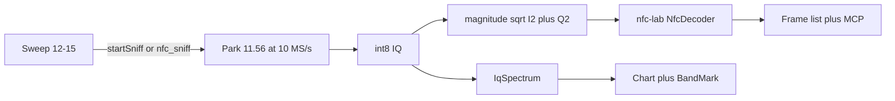

# NFC park + nfc-laboratory frames

**Status:** in progress 2026-08-23 — park + decoder + MCP wired; hardware IT open
**Started:** 2026-08-23

Living plan so a later agent can implement without chat history. Sweep classifier (`nfc_activity`) is already shipped ([nfc-spectrum.md](nfc-spectrum.md)). This plan is the parked-IQ follow-on: same USB session, spectrum + packets.

## Goal

The operator (or MCP) can **Sniff** NFC the way they Listen FM or Watch TV: the radio leaves sweep, parks IQ, and the **same samples** drive the spectrum chart and a frame list.

[nfc-laboratory](https://github.com/josevcm/nfc-laboratory) (GPL-3) already decodes NFC-A/B/F/V from HackRF IQ. Use its **decoder**, not its Qt app and not its HackRF backend.

v1 success: Type A **106 kb/s** frames (REQA / ATQA / UID / SELECT) while the 12–15 MHz chart stays live. Sweep resumes cleanly after Stop.

## Hard rules

- **One radio.** Sniff stops the sweep. Do not time-slice. Agents copy bins/frames; they never open USB.
- Overlays still go through `FrequencyAxis` + `BandMark` + `NfcBandLayer`. Do not invent a second MHz↔pixel map.
- LO is **11.56e6 Hz**. Never 13.56 (carrier must not sit on the zero-IF DC spike). Sample rate **10e6**. Analog BB filter is already `sample_rate/2` in [`src-c/hackrf_fm.c`](../../src/hotiron/src-c/hackrf_fm.c) (~5 MHz).
- Receive only. No emulate, clone, APDU replay, field TX, or EMV helpers.
- Do **not** rewrite ISO 14443 in Java. Do **not** grow a Proxmark stack.
- When this lands, update [`docs/nfc.md`](../nfc.md) “What not to build”: drop the blanket ban on UID/APDU **display**. Keep the ban on a second decoder and on TX. Show what nfc-lab already shows (frame name, tech, rate, UID/ATQA, raw hex).

## Study findings (do not rediscover)

nfc-lab is a Qt desktop (`src/nfc-app`) plus libraries (`src/nfc-lib`). The decoder is C++:

| Piece | Path in nfc-lab | HotIron use |
|---|---|---|
| `NfcDecoder` | `lib-lab/lab-radio` (`NfcDecoder.cpp`, `tech/NfcA.cpp` …) | **Yes** — `nextFrames(hw::SignalBuffer)` |
| `RawFrame` | `lib-lab/lab-data` | **Yes** — frame records |
| `SignalBuffer` | `lib-hw/hw-dev` | **Yes** — wrap magnitude samples |
| `rt-lang` Logger | `lib-rt/rt-lang` | Link or **shim** if it drags |
| `hw-radio` | Airspy / Hydra / **HackrfDevice** / RTL / Miri + mufft | **No** — USB fight + extra deps |
| `lib-ext` | their vendored hackrf | **No** |
| `nfc-app` | Qt UI | **No** |

Their HackRF recipe (README `[device.radio.hackrf]`):

- `centerFreq=11560000` — 13.56 lands at **+2 MHz IF**
- `sampleRate=10000000`
- Default LNA mode `2` = **8 dB** (conservative; our 8-bit ADC slams next to a door reader)
- Decoder input after capture is **magnitude** `sqrt(I²+Q²)`, not complex FFT bins

`lab-radio` CMake does `target_link_libraries(lab-radio lab-data rt-lang hw-radio)`. That `hw-radio` line is why a naive “add the submodule and build” is wrong. First spike must link **without** `hw-radio`.

`hackrf_fm_lib_start` already accepts arbitrary LO + rate. [`HackRFFmNativeBridge.start`](../../src/hotiron/src/main/java/hotiron/nativebridge/HackRFFmNativeBridge.java) is the Java door. [`FmListenEngine`](../../src/hotiron/src/main/java/hotiron/core/FmListenEngine.java) / [`TvWatchEngine`](../../src/hotiron/src/main/java/hotiron/core/TvWatchEngine.java) are the pattern: USB callback only `offerIq`; worker does DSP.

Today [`RadioMode`](../../src/hotiron/src/main/java/hotiron/core/RadioMode.java) is `SWEEP / LISTEN / WATCH / STOPPED`. Parked + `ListenService.TV` → `WATCH`; any other parked service → `LISTEN`. [`ListenService`](../../src/hotiron/src/main/java/hotiron/core/ListenService.java) is `FM, TV` only. Header-click on an NFC tick is **Scan** (12–15 → 26–28 → 40–42), not park.

## Rejected paths

- Subprocess nfc-lab — exclusive USB, same as two GUIs.
- Link `hw-radio` / `HackrfDevice.cpp` — second USB open, Airspy/RTL/mufft.
- Home-grown Miller/Manchester — violates “don’t invent a second NFC stack.”
- Waterfall PNG over MCP as a packet substitute — lossy, already have `spectrum_history_bins`.
- Mapping NFC onto `RadioMode.LISTEN` — `sweep_config.radioMode` would lie (`listen` ≠ sniff).

## Architecture

Complex IQ goes to `IqSpectrum` (real spectrum). Magnitude goes to `NfcDecoder`. Do not FFT the magnitude stream. Do not decode FFT bins.

## How to implement (agent checklist)

Do the **link spike** first. If that fails, stop and shim `Logger` / `RecordDevice` only — do not shim the PHY.

### 1. Native decoder spike

- Add git submodule `src/hotiron/lib/nfc-laboratory` (pin a commit, same habit as `lib/hackrf`).
- First-party C ABI in `src/hotiron/src-c/nfc_dec.h` + `nfc_dec.cpp`:
  - `nfc_dec_create` / `nfc_dec_destroy` / `nfc_dec_set_sample_rate(10000000)`
  - `nfc_dec_process_iq(const int8_t *iq, int nbytes)` — interleaved signed 8-bit IQ → float magnitude → `hw::SignalBuffer` → `NfcDecoder::nextFrames`
  - emit a POD list: tech, phase, rate, t0/t1, name, hex (cap payload, e.g. 256 B)
- Compile **only** `lab-radio` sources + `lab-data` + `hw-dev` + `rt-lang`. Exclude `hw-radio`, `lib-ext`, `nfc-app`. Leave `NfcSignalDebug` / WAV off.
- Link into the existing `hackrf-sweep` native lib (or a sibling `.so` next to it). Add `##` help lines on both root `Makefile` and `src/hotiron/Makefile` if you add targets.
- JNA next to `HackRFFmNativeBridge` (hand-maintained, no JNAerator).
- Linux first. Windows only if the same mingw tree that builds ATSC compiles this subset.

### 2. Park mode

- `ListenService.NFC` and `RadioMode.NFC`. `RadioMode.from`: parked + NFC → `NFC`. `parked()` is `LISTEN || WATCH || NFC`.
- `HackRFSettings.startSniff()` / `AnalyzerSettings.startSniff()`: `stopScan()`, `listenService=NFC`, `listening=true`, `radioReleased=false`, `hardware.startSniff()`. Mirror `startListen` / `startWatch` in [`AnalyzerSettings.java`](../../src/hotiron/src/main/java/hotiron/core/AnalyzerSettings.java) (~310).
- `RadioCoordinator`: retune listeners stay FM-only / TV-only; NFC LO is fixed (11.56). Gain apply while parked still `applyNow`.
- `RadioSession.Driver.startExclusive(RadioMode.NFC)` → `HotIron` park thread: `HackRFFmNativeBridge.start(iq -> nfcEngine.offerIq(iq), 11_560_000L, 10_000_000, …)`.
- Header-click **Scan stays Scan**. Sniff is a new sidebar/HUD control + MCP write. Do not steal `startNfcScan`.

### 3. Engine / spectrum / UI

- `NfcSniffEngine` in `hotiron.core` (USB callback only enqueues). Worker: `IqSpectrum(10_000_000)` + `nfc_dec_process_iq`.
- Chart: parked FFT through `DatasetSpectrumPeak` so peak / persistence / `spectrum_history` stay live. Axis 12–15 MHz (or full ±5 MHz around 11.56). Overlay still `NfcBandLayer`.
- Waterfall: 12–15 MHz parked FFT raster (Watch-style). Sidebar: 500 ms 13.56 |IQ| after IF mix (`NfcEnvelopeTrace`). Not AUDIO, not wideband |z|.
- Sidebar frame list (tech, name, hex, Δt). HUD: field on/off + last frame. Loop-antenna reminder in operator docs.
- `NfcSniffGainPolicy`: Type A 100% ASK is carrier dropouts, not clip. Do not pump. Seed conservative (nfc-lab LNA 8 dB). Do not write Antenna LNA as a “leave it on after sniff” checkbox (Watch already has this trap).

### 4. MCP

- Write `nfc_sniff` → `settings.startSniff()` on the EDT (same bind as `fm_listen` in [`SpectrumMcpTools`](../../src/hotiron/src/main/java/hotiron/mcp/SpectrumMcpTools.java)).
- Read `nfc_frames` from a ring on `SpectrumSnapshotStore` (cap ~200). Snapshot tools must not restart USB.
- `sweep_config.radioMode` = `nfc`. Keep `nfc_activity` for the **sweep** classifier.
- While sniffing, `spectrum_history` / `spectrum_history_bins` are the **local IQ window**, same as Listen/Watch.

### 5. Tests (radio-free first)

- Synthetic int8 IQ: 10 MS/s, LO 11.56, CW at +2 MHz IF, Type A 106 kb/s REQA (ATQA if cheap). Native ABI + engine must emit a named frame. No HackRF.
- `RadioMode` / `startSniff` / `RadioCoordinator` characterization (copy [`RadioCoordinatorTest`](../../src/hotiron/src/test/java/hotiron/core/RadioCoordinatorTest.java) style).
- Hardware IT later: sniff start/stop then resume sweep (Listen IT pattern). `make test` stays radio-free.

### 6. Docs (same change as the code, not a leftover)

- This file: Status + checkboxes stay honest.
- [`docs/plans/README.md`](README.md) already lists this plan under Active once indexed.
- [`docs/nfc.md`](../nfc.md), [`docs/operator.md`](../operator.md), [`docs/agents.md`](../agents.md), [`docs/architecture.md`](../architecture.md), [`AGENTS.md`](../../AGENTS.md), CHANGELOG Unreleased.
- `make mermaid` after diagram edits. `make stats` after structural changes. Do not hand-edit [`docs/stats.md`](../stats.md).

## Files an implementer will touch

| Area | Files |
|---|---|
| Native ABI | `src/hotiron/src-c/nfc_dec.h`, `nfc_dec.cpp`; `src/hotiron/Makefile`; root `Makefile` |
| Submodule | `src/hotiron/lib/nfc-laboratory` (new), `.gitmodules` |
| JNA | `hotiron.nativebridge` + `HackrfSweepLibrary` if symbols live in the sweep `.so` |
| Mode | `ListenService`, `RadioMode`, `HackRFSettings`, `AnalyzerSettings`, `RadioCoordinator`, `RadioSession` tests |
| Engine | new `NfcSniffEngine`, `NfcSniffGainPolicy` |
| UI | `HotIron` park branch, `HackRFSweepSettingsUI`, frame list, HUD |
| MCP | `SpectrumMcpTools`, `SpectrumSnapshotStore` |
| Tests | `core` synthetic IQ + mode tests; later `*IT` |
| Docs | this plan + nfc/operator/agents/architecture/AGENTS/CHANGELOG |

## Checklist

- [x] Study nfc-lab layout, HackRF recipe (11.56 / 10 MS/s), `NfcDecoder` API, `hw-radio` hazard
- [x] Confirm HotIron park path (`hackrf_fm` + `IqSpectrum` + `RadioSession`) can take 11.56 / 10e6 without a second USB
- [x] Write this living plan + index it
- [x] Spike: submodule pin + link `lab-radio` **without** `hw-radio`; `nfc_dec_process_iq` C ABI
- [x] `ListenService.NFC` + `RadioMode.NFC` + `startSniff` + `NfcSniffEngine`
- [x] Parked `IqSpectrum` chart / overlay + envelope waterfall + sidebar frames + Sniff control
- [x] MCP `nfc_sniff` + `nfc_frames`; `sweep_config.radioMode=nfc`
- [x] Injected-decoder / crop / mode / coordinator tests (native REQA IQ still optional)
- [x] Docs listed above; `make test`; `make mermaid`; `make stats`
- [ ] Hardware IT: sniff → stop → sweep resume (when a loop antenna is on the SMA)

## Non-goals (v1)

NFC-F/V and 212+ kb/s as **success criteria** (decoder may emit them; do not tune for them). Proxmark USB ingest. TRZ export. Qt UI. Time-slice sweep+NFC. TX. Second HackRF. Embedding nfc-lab’s spectrum widget.

## Tonight without this work

Close HotIron. Run nfc-laboratory on this HackRF (11.56 MHz / 10 MS/s, loop or salvaged RC522 coil — not a Wi-Fi whip). Same USB cannot do both.

## Companion plans

- [nfc-spectrum.md](nfc-spectrum.md) — done. Sweep overlay + `nfc_activity`. Do not reopen that checklist.
- [fm-radio-tuner.md](fm-radio-tuner.md) — parked-IQ pattern to copy.
- [atsc-tv-watch.md](atsc-tv-watch.md) — second park mode + preview box pattern.
- [radio-apply.md](radio-apply.md) — add settings/listeners here, not as `flag*` on `HotIron`.
