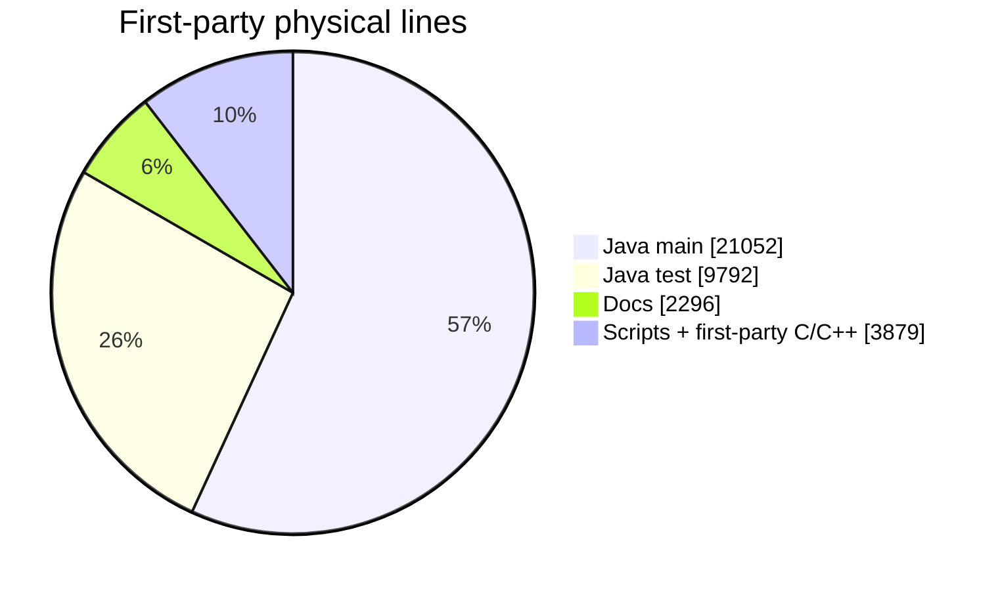
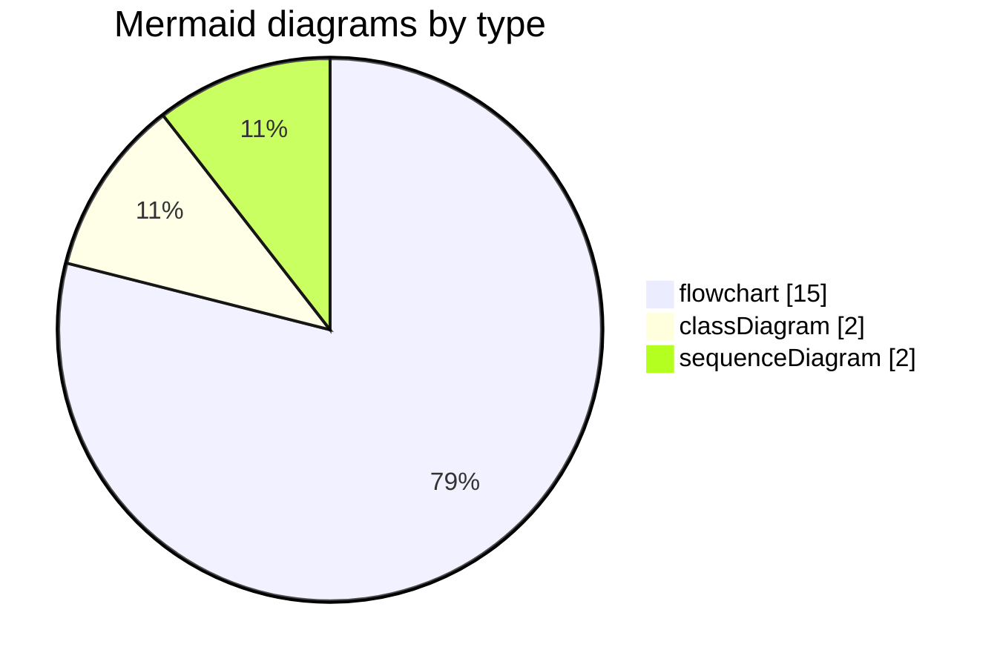

<!-- Generated by scripts/repo-stats.py / `make stats`. Do not edit by hand. -->

# Repository stats

Refreshed **2026-08-23 17:13 UTC** from `cdeab5b` on `master` (last commit 2026-08-23 01:53:05 -0600).

Regenerate:

```bash
make stats
# or
python3 scripts/repo-stats.py
```

Vendor trees (`src/hotiron/lib/hackrf`, libusb, FFTW, and `src-c/atsc/{lib,fec,shim}` GNU Radio/libfec), `target/`, and `build/` are **excluded**. These numbers describe first-party code and docs.

## Snapshot

| | |
|---|---|
| App version | `2.0.2` |
| Java `--release` | 21 |
| Host SDK pin | `v2026.01.3` |
| Minimum firmware | `2024.02.1` |
| Quick Select presets | 16 |
| USA allocation rows | 574 |
| Git commits on this branch | 120 |
| First-party lines (all counted trees) | 37019 |



## Java by area

Production (`src/main/java`): **129** files, **21052** lines.

| Package | Files | Lines |
|---|---:|---:|
| `hotiron/core` | 77 | 11240 |
| `hotiron/ui` | 31 | 4482 |
| `hotiron/mcp` | 7 | 2244 |
| `hotiron` | 2 | 1939 |
| `hotiron/nativebridge` | 5 | 525 |
| `hotiron/capture` | 2 | 251 |
| `hotiron/mvc` | 2 | 249 |
| `hotiron/core/jfc` | 2 | 61 |
| `hotiron/jna` | 1 | 61 |

Tests (`src/test/java`): **106** files, **9792** lines.

| Package | Files | Lines |
|---|---:|---:|
| `hotiron/core` | 59 | 5883 |
| `hotiron/ui` | 24 | 1711 |
| `hotiron/mcp` | 6 | 790 |
| `hotiron/hw` | 6 | 621 |
| `hotiron` | 3 | 390 |
| `hotiron/mvc` | 2 | 186 |
| `hotiron/nativebridge` | 2 | 101 |
| `hotiron/core/jfc` | 3 | 74 |
| `hotiron/capture` | 1 | 36 |

### Tests

| Kind | Count |
|---|---:|
| Unit test classes (`@Test`, not `*IT`) | 99 |
| `@Test` methods (unit + hardware IT) | 526 |
| Hardware IT classes (`*IT`) | 1 |
| `@HardwareTest` methods | 8 |
| Support types (fakes, annotations, helpers) | 6 |

`make test` runs the unit classes only. `make test-hw` runs the hardware IT and skips if no radio is enumerated.

## Other first-party trees

| Tree | Files | Lines |
|---|---:|---:|
| Docs (`docs/`) | 21 | 2296 |
| Scripts (`scripts/`) | 9 | 1341 |
| First-party C/C++ / patch (`src-c/`) | 18 | 2538 |

## Build surface

| Makefile | Documented / named targets |
|---|---|
| Root | 16 (`help`, `deps`, `runtime-deps`, `build`, `clean`, `test`, `native-test`, `test-hw`, `lint`, `stats`, `mermaid`, `info`, `firmware-update`, `udev`, `start`, `mcp`) |
| `src/hotiron` | 20 |

## Diagrams

19 Mermaid fences in first-party Markdown. Check they still parse with `make mermaid`.

| File | Type |
|---|---|
| `README.md` | `flowchart` |
| `docs/agents.md` | `flowchart` |
| `docs/architecture.md` | `classDiagram` |
| `docs/architecture.md` | `classDiagram` |
| `docs/architecture.md` | `flowchart` |
| `docs/architecture.md` | `flowchart` |
| `docs/architecture.md` | `flowchart` |
| `docs/architecture.md` | `flowchart` |
| `docs/architecture.md` | `sequenceDiagram` |
| `docs/building.md` | `flowchart` |
| `docs/contributing.md` | `flowchart` |
| `docs/develop.md` | `flowchart` |
| `docs/develop.md` | `sequenceDiagram` |
| `docs/getting-started.md` | `flowchart` |
| `docs/hardware.md` | `flowchart` |
| `docs/nfc.md` | `flowchart` |
| `docs/nfc.md` | `flowchart` |
| `docs/operator.md` | `flowchart` |
| `docs/plans/nfc-laboratory.md` | `flowchart` |



## Largest first-party Java files

| File | Lines |
|---|---:|
| `src/hotiron/src/main/java/hotiron/HotIron.java` | 1932 |
| `src/hotiron/src/main/java/hotiron/core/TvWatchEngine.java` | 761 |
| `src/hotiron/src/main/java/hotiron/ui/HackRFSweepSettingsUI.java` | 737 |
| `src/hotiron/src/main/java/hotiron/ui/WaterfallPlot.java` | 701 |
| `src/hotiron/src/main/java/hotiron/core/MpegTsPlayer.java` | 620 |
| `src/hotiron/src/main/java/hotiron/mcp/SpectrumSnapshotStore.java` | 589 |
| `src/hotiron/src/main/java/hotiron/core/AnalyzerSettings.java` | 519 |
| `src/hotiron/src/main/java/hotiron/mcp/SpectrumSnapshot.java` | 488 |

`HotIron.java` is the Swing shell. Prefer growing `core/` and tests rather than this class.

## Git authors

| Author | Commits |
|---|---:|
| Chris Piekarski | 40 |
| Pavol Sakac | 27 |
| selabnayr | 24 |
| _sekki | 12 |
| pavsa | 10 |
| Christopher Piekarski | 3 |
| Kezi | 2 |
| izzy84075 | 2 |

## How this is counted

- Physical lines (newline-separated), UTF-8, replacement on decode errors.
- A Java *unit test class* is a file that contains `@Test` and is not named `*IT.java`.
- Quick Select presets are enum constants in `QuickSelectPreset`.
- USA allocation rows are data lines in `freq-usa.csv` (header excluded).
- Re-run after large moves or new packages so [AGENTS.md](../AGENTS.md) can point here instead of baking stale counts.
